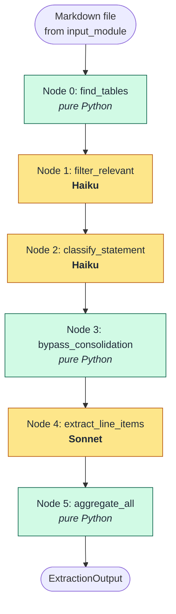
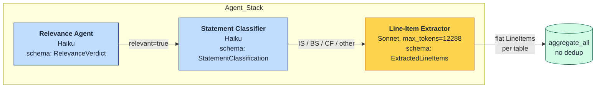
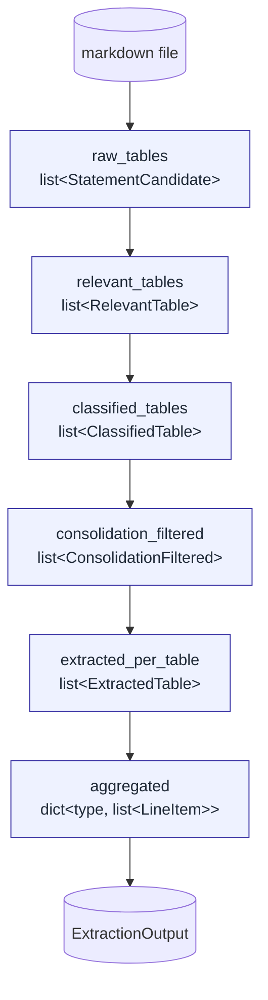
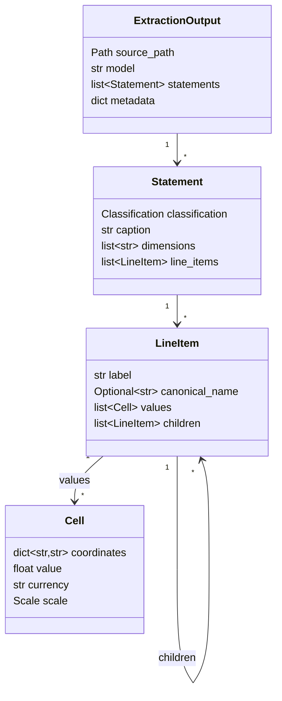

# Fundamentals Module — Detailed Documentation

A LangGraph-based pipeline that ingests a markdown rendering of a financial filing and produces a structured `ExtractionOutput` containing Income Statement, Balance Sheet, and Cash Flow data. The pipeline composes single-purpose LLM "agents" (relevance filter, statement classifier, line-item extractor) with pure-Python stages (table discovery, aggregation).

Source: [src/fundamentals_module/](src/fundamentals_module/)

---

## 1. Module Layout

| File | Role |
|---|---|
| [extractor.py](src/fundamentals_module/extractor.py) | Top-level orchestrator. Builds the graph, streams progress, packages the final state into `ExtractionOutput`. |
| [graph.py](src/fundamentals_module/graph.py) | LangGraph DAG assembly. Wires the 6-node pipeline. |
| [nodes.py](src/fundamentals_module/nodes.py) | All node functions. Each reads upstream state, calls one LLM (or runs pure Python), returns a partial state dict. |
| [state.py](src/fundamentals_module/state.py) | `PipelineState` — the Pydantic object that flows through the graph. Per-node intermediate types. |
| [models.py](src/fundamentals_module/models.py) | Public data contracts: `Cell`, `LineItem`, `Statement`, `ExtractionOutput`, plus per-node schemas. |
| [llm.py](src/fundamentals_module/llm.py) | `StructuredExtractor` — thin wrapper around the LLM client with `with_structured_output`. |
| [prompts.py](src/fundamentals_module/prompts.py) | Module-level prompt constants (one per agent). Kept stable so prefix caching amortizes cost. |
| [table_finder.py](src/fundamentals_module/table_finder.py) | Pure-Python markdown scanner. Locates `<table>` blocks with depth-tracking, captures heading context. |
| [validator.py](src/fundamentals_module/validator.py) | Coordinate-aware math validator. Walks the line-item tree and verifies parent ≡ Σ children. |
| [settings.py](src/fundamentals_module/settings.py) | Env-driven configuration. Bootstraps the FactSet CA bundle once. |
| [cli.py](src/fundamentals_module/cli.py) | `python -m src.fundamentals_module.cli <md_path>` entry point. |

---

## 2. End-to-End Pipeline



**Node count:** 6 nodes. No retry loop in the current configuration.

**LLM calls per document:** roughly `R + C + Te` where `R` = #raw tables (relevance filter), `C` = #relevant tables (classifier), `Te` = #classified tables (line-item extractor).

---

## 3. Agents Pipeline (LLM-backed nodes)

Each agent is a single-purpose LLM call bound to a Pydantic schema via `StructuredExtractor` ([llm.py](src/fundamentals_module/llm.py)). The schema is communicated via tool-calling — this guarantees a typed return.



### 3.1 Agent #1 — Relevance Filter (Haiku)

| | |
|---|---|
| Function | `filter_relevant` |
| Prompt | `RELEVANCE_PROMPT` |
| Output schema | `RelevanceVerdict` — `{relevant: bool, reason: str}` |
| Per-call input | Caption + nearest H1/H2 + outer scale annotation + full table HTML |

Drops KPI dashboards, narrative tables, ratings tables, glossaries, and pure-ratio tables. Keeps headline statements, segment P&Ls, and any breakdown table whose rows decompose an IS/BS/CF variable (RWA, capital composition, debt maturity ladder, fee breakdown).

**Bypass alternative:** `bypass_filter` marks all raw tables as relevant without an LLM call — useful for full-coverage extraction runs.

### 3.2 Agent #2 — Statement Classifier (Haiku)

| | |
|---|---|
| Function | `classify_statement` |
| Prompt | `STATEMENT_CLASSIFIER_PROMPT` |
| Output schema | `StatementClassification` — `{statement_type, is_breakdown, breakdown_of}` |

Tags each surviving table as `IS` / `BS` / `CF` / `other`. Unlike the original design, **`other` tables are now kept** — they flow through to extraction so no data is silently discarded. `is_breakdown=true` marks decomposition tables (operating-expense breakdown, RWA breakdown, etc.).

### 3.3 Node 3 — Bypass Consolidation (pure Python)

| | |
|---|---|
| Function | `bypass_consolidation` |
| LLM | None |

Replaces the original `classify_consolidation` LLM node. Passes every classified table through with `consolidated_columns=[]`, which signals `extract_line_items` to keep **all numeric columns**. Column header filtering is instead handled inside the extraction prompt (see §3.4).

### 3.4 Agent #4 — Line-Item Extractor (Sonnet)

| | |
|---|---|
| Function | `extract_line_items` |
| Prompt | `LINE_ITEM_EXTRACTION_PROMPT` |
| Output schema | `ExtractedLineItems` — flat `list[LineItem]`, no children |
| max_tokens | 12 288 |

The heavyweight call. Extracts every numeric row from every surviving table into a flat list of `LineItem`s. Key prompt rules:

**Variance/comparison columns are always skipped.** Column headers matching any of the following are excluded — even when "all numeric columns" was requested:

> `"Amount"`, `"%"`, `"Variance"`, `"Change"`, `"Difference"`, `"vs."`, `"+/-"`, `"bps"`, `"Basis Points"`, `"Increase"`, `"Decrease"`, or any bare percentage symbol.

**Every data row is emitted** — including sub-items beneath section headers ("Cash on hand" under "Cash and cash equivalents:", "Additional paid-in capital" under "Stockholders' equity"). Only section subheader rows whose value cells are all empty are dropped.

Each `Cell` carries:
- `period_end` — ISO `YYYY-MM-DD`
- `period_type` — `"point"` for BS; `"3M"` / `"6M"` / `"9M"` / `"12M"` for IS/CF
- Optionally: `segment_id`, `consolidation`, `maturity_bucket`, `time_basis`, `scenario`

Parenthesized negatives are resolved (`"(123)"` → `-123`). Footnote markers are stripped. Per-row unit overrides respected.

---

## 4. Data Flow & State



The `PipelineState` carries every one of these fields. Each node populates one new field; earlier fields stay populated so diagnostics can replay any stage. Updates flow only through the partial dict each node returns — nothing is mutated in place.

### 4.1 Aggregation rule (Node 5 — `aggregate_all`)

Every extracted `LineItem` is collected as-is — **no deduplication by canonical label**. Each `Cell` receives an additional `source_table` coordinate (table caption or `nearest_h2`) that disambiguates identical labels from different tables (e.g. "Net income" from a 3-month IS vs a 6-month IS).

Because cells from different period columns already carry distinct `period_end` + `period_type` coordinates, the same label extracted from two tables appears once with multiple cells — one per table × period combination.

The older `aggregate` function (deduplicates by canonical label, first-value-wins on coordinate conflicts) is preserved in `nodes.py` for reference but is not wired into the current graph.

---

## 5. Table Discovery

### 5.1 `find_tables` and `_find_table_spans`

`_find_table_spans` replaces the original single greedy regex `<table\b.*?</table>`. It uses **depth tracking** to correctly handle:

- **Nested `<table>` tags** (depth > 1 increments depth counter).
- **Unclosed tables** — if a top-level `<table>` has no matching `</table>` before the next top-level `<table>` open, the span is bounded at the next open tag rather than greedily consuming all remaining content.

This prevents the common OCR failure where an unclosed IS 6-month table merges with the following NIM analysis table into one span.

```python
def _find_table_spans(md_text: str) -> list[tuple[int, int]]:
    """(start, end) spans for every top-level <table> block."""
```

### 5.2 `find_tables_node` — per-table candidates

`find_tables_node` no longer calls `group_into_statements`. Each discovered `<table>` block becomes its own `StatementCandidate` with a single table. This gives the pipeline a 1-to-1 mapping between HTML tables and extraction candidates.

`group_into_statements` is retained in `table_finder.py` for use cases that need to group consecutive same-heading tables (e.g. BS Assets + BS Liabilities).

`find_tables_individual` is an alias with the same behaviour as the current `find_tables_node` and is available for explicit calls.

---

## 6. Output Schema



`ExtractionOutput` is built from `final_state.aggregated` (the flat line items after Node 5). `children` on each `LineItem` is empty — hierarchy building is not part of the current pipeline.

### 6.1 Cell coordinates

Every `Cell.coordinates` always carries:
- `period_end` — ISO `YYYY-MM-DD`
- `period_type` — `"point"` for BS items; `"3M"` / `"6M"` / `"9M"` / `"12M"` for IS/CF flows
- `source_table` — caption or `nearest_h2` of the table it came from (added by `aggregate_all`)

Optional dimensions when the table has them:
- `segment_id`, `consolidation`, `maturity_bucket`, `time_basis`, `scenario`

### 6.2 Metadata fields

| Field | Content |
|---|---|
| `diagnostics` | Per-node trail — node name, counts, kept/dropped detail |
| `retries_used` | Always `0` in current configuration |
| `validation_failures` | Always empty (validator not wired) |
| `table_count` | Total `StatementCandidate` objects found |
| `extracted_table_count` | Tables that survived to the line-item extractor |

---

## 7. Public API

```python
from fundamentals_module import extract_fundamentals

result = extract_fundamentals("out_md/some_filing.md")
# result is an ExtractionOutput
```

Class form:

```python
from fundamentals_module import FundamentalsExtractor

extractor = FundamentalsExtractor(model="anthropic.claude-sonnet-4-6", verbose=True)
result = extractor.extract(Path("out_md/some_filing.md"))
```

CLI:

```
python -m src.fundamentals_module.cli <md_path> [--out json] [--model …] [--no-llm] [--quiet]
```

`--no-llm` runs only the table-finder and prints the candidate summary — useful for verifying detection without burning tokens.

**Step-by-step notebook pattern:**

```python
from src.fundamentals_module.state import PipelineState
from src.fundamentals_module.nodes import (
    find_tables_node, filter_relevant, classify_statement,
    bypass_consolidation, extract_line_items, aggregate_all,
)
from src.fundamentals_module.settings import settings

state = PipelineState(
    md_path=Path("out_md/filing.md"),
    model_haiku=settings.model_haiku,
    model_sonnet=settings.model_sonnet,
    model_provider=settings.model_provider,
)

for fn in [find_tables_node, filter_relevant, classify_statement,
           bypass_consolidation, extract_line_items, aggregate_all]:
    state = state.model_copy(update=fn(state))
    print(state.diagnostics[-1])
```

---

## 8. Configuration

Environment-driven via [settings.py](src/fundamentals_module/settings.py):

| Variable | Default | Purpose |
|---|---|---|
| `LLM_ENDPOINT` | unset | Azure OpenAI-compatible base URL |
| `LLM_API_KEY` | unset | API key |
| `LLM_API_VERSION` | `20250929-v1:0` | API version string |
| `MODEL_HAIKU` | `anthropic.claude-4-5-haiku` | Relevance + classifier nodes |
| `MODEL_SONNET` | `anthropic.claude-sonnet-4-6` | Line-item extractor |
| `DEFAULT_MODEL` | `anthropic.claude-sonnet-4-6` | Used when `model=None` |
| `MODEL_PROVIDER` | `proprietary` | `"proprietary"` (Azure Claude) or `"opensource"` (Qwen) |
| `MODEL_QWEN` | `Qwen/Qwen3-30B-A3B` | Used when `model_provider="opensource"` |

On import, `setup_ssl_certificate()` downloads the FactSet CA bundle and sets `SSL_CERT_FILE` exactly once per process.

---

## 9. Available but Inactive Nodes

The following nodes exist in `nodes.py` and are fully functional but are **not wired into the current `graph.py`**. They can be composed manually for specific use cases.

| Node | Function | Purpose |
|---|---|---|
| Consolidation classifier | `classify_consolidation` | LLM call (Haiku) that identifies consolidated vs parent-only columns and detects segment tables. Column header indices are returned for use by `extract_line_items`. |
| Hierarchy builder | `build_hierarchy` | Sonnet call that organises the flat aggregated list into a parent/child tree where every parent ≡ Σ children at every coordinate. |
| Math validator | `validate_node` | Pure Python. Walks the hierarchy tree and emits `ValidationFailure` for every broken parent/sum identity. |
| Retry gate | `should_retry` / `increment_retry` | Conditional edge: loops back to `build_hierarchy` if failures remain and retries < 1. |
| No-dedup aggregate | `aggregate` | Original aggregation with canonical-label deduplication (first-value-wins on coordinate conflicts). |
| Classify all | `classify_statement_all` | Variant of `classify_statement` that keeps `other`-classified tables rather than counting them separately. |

To re-enable the hierarchy path, update `graph.py` to add the nodes and edges:

```python
graph.add_node("aggregate",        nodes.aggregate)
graph.add_node("build_hierarchy",  nodes.build_hierarchy)
graph.add_node("validate",         nodes.validate_node)
graph.add_node("retry_gate",       nodes.increment_retry)

graph.add_edge("aggregate",       "build_hierarchy")
graph.add_edge("build_hierarchy", "validate")
graph.add_conditional_edges("validate", nodes.should_retry,
    {"build_hierarchy": "retry_gate", "__end__": END})
graph.add_edge("retry_gate", "build_hierarchy")
```

And update `extractor.py`'s `_to_output` to read from `final_state.hierarchical` instead of `final_state.aggregated`.

---

## 10. Design Choices & Tradeoffs

- **Per-table extraction (no grouping).** Each `<table>` is its own candidate. This eliminates the risk of an OCR-induced unclosed table merging with an adjacent unrelated table and being processed as one unit.
- **Bypass consolidation, filter in prompt.** Rather than running a Haiku LLM call per table to identify consolidated columns, the extraction prompt instructs Sonnet to skip variance/comparison columns by header keyword. This saves one LLM call per table and avoids false column drops when column header text is ambiguous.
- **No deduplication in aggregate.** `aggregate_all` preserves every extracted item. The `source_table` coordinate on every cell makes the origin traceable. Downstream consumers can deduplicate by label + period if needed.
- **Flat output (no hierarchy).** The pipeline returns the raw flat list per statement type. This is fast and complete — no data is lost to a hierarchy mismatch. The hierarchy builder (§9) can be re-enabled when the tree structure is required.
- **`other` tables kept.** The classifier labels all tables but drops nothing. NIM analysis tables, selected financial data, and yield/cost schedules are extracted alongside headline IS/BS/CF statements. The `statement_type` label organises them; consumers filter as needed.
- **Depth-tracking table scanner.** The original greedy regex `<table\b.*?</table>` would swallow nested or unclosed tables. The current scanner bounds unclosed spans at the next top-level `<table>` open, giving one span per HTML table regardless of OCR completeness.
