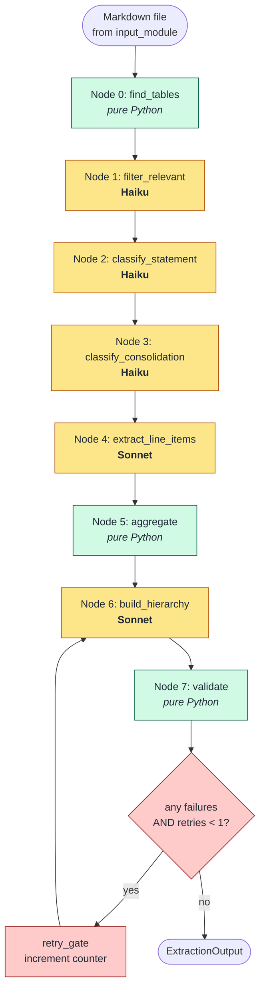
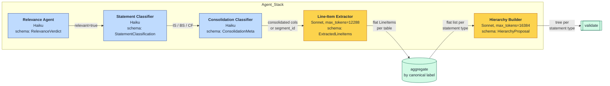
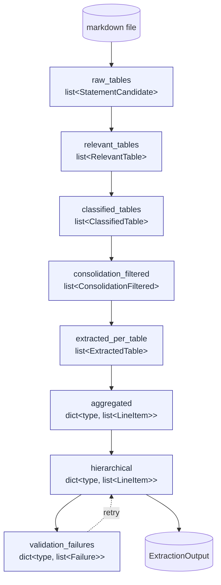
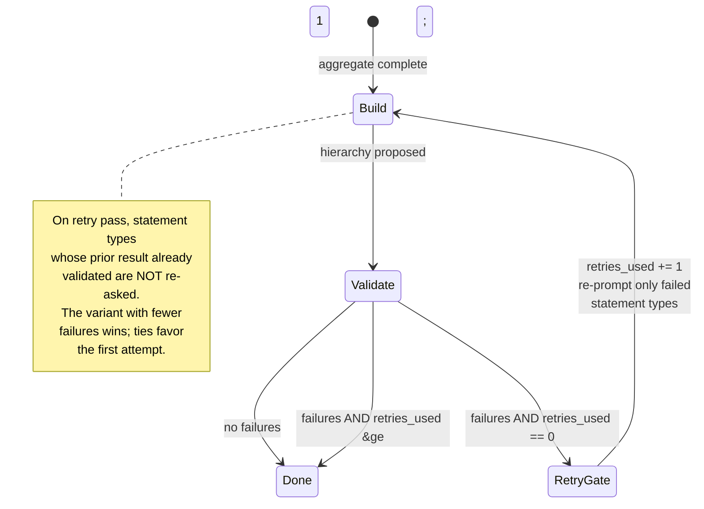
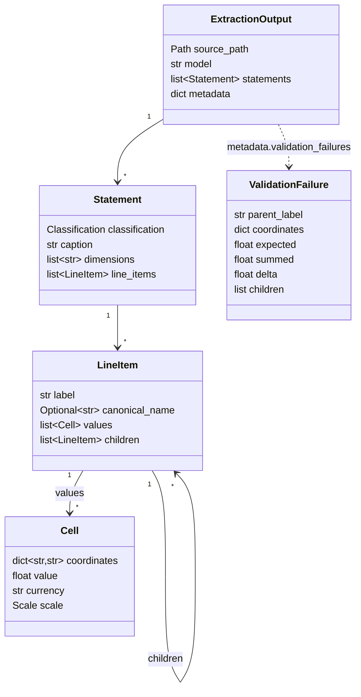

# Fundamentals Module — Detailed Documentation

A LangGraph-based pipeline that ingests a markdown rendering of a financial filing and produces a structured `ExtractionOutput` containing Income Statement, Balance Sheet, and Cash Flow data. The pipeline composes single-purpose LLM "agents" (relevance, classifier, consolidation, line-item extractor, hierarchy builder) with pure-Python stages (table discovery, aggregation, math validation, retry gate).

Source: [src/fundamentals_module/](src/fundamentals_module/)

---

## 1. Module Layout

| File | Role |
|---|---|
| [extractor.py](src/fundamentals_module/extractor.py) | Top-level orchestrator. Builds the graph, streams progress, packages the final state into `ExtractionOutput`. |
| [graph.py](src/fundamentals_module/graph.py) | LangGraph DAG assembly. Wires nodes and the validate → retry conditional edge. |
| [nodes.py](src/fundamentals_module/nodes.py) | All node functions. Each reads upstream state, calls one LLM (or runs pure Python), returns a partial state dict. |
| [state.py](src/fundamentals_module/state.py) | `PipelineState` — the Pydantic object that flows through the graph. Per-node intermediate types (`RelevantTable`, `ClassifiedTable`, …). |
| [models.py](src/fundamentals_module/models.py) | Public data contracts: `Cell`, `LineItem`, `Statement`, `ExtractionOutput`, plus per-node schemas. |
| [llm.py](src/fundamentals_module/llm.py) | `StructuredExtractor` — thin wrapper around `AzureChatOpenAI` with `with_structured_output`. Cached per deployment. |
| [prompts.py](src/fundamentals_module/prompts.py) | Module-level prompt constants (one per agent). Constants are kept stable so prefix caching amortizes cost. |
| [table_finder.py](src/fundamentals_module/table_finder.py) | Pure-Python markdown scanner. Locates `<table>` blocks, captures heading context, groups consecutive related tables into one candidate. |
| [validator.py](src/fundamentals_module/validator.py) | Coordinate-aware math validator. Walks the line-item tree and verifies parent ≡ Σ children at every coordinate point. |
| [settings.py](src/fundamentals_module/settings.py) | Env-driven configuration. Bootstraps the FactSet CA bundle exactly once. |
| [cli.py](src/fundamentals_module/cli.py) | `python -m src.fundamentals_module.cli <md_path>` entry point with a `--no-llm` smoke check. |

---

## 2. End-to-End Pipeline



**Node count:** 9 functional steps + 1 conditional edge.
**LLM calls per document:** roughly `R + C + Cf + Te + 3` where `R` = #raw candidates, `C` = #relevant candidates, `Cf` = #classified candidates, `Te` = #consolidation-filtered tables, plus up to 3 hierarchy calls per statement type (×2 if a retry triggers).

---

## 3. Agents Pipeline (LLM-backed nodes)

Each agent is a single-purpose LLM call bound to a Pydantic schema via `StructuredExtractor` ([llm.py](src/fundamentals_module/llm.py)). The schema is communicated via tool-calling, not via the prompt — this guarantees a typed return.



### 3.1 Agent #1 — Relevance Filter (Haiku)

| | |
|---|---|
| Function | [`filter_relevant`](src/fundamentals_module/nodes.py#L139) |
| Prompt | `RELEVANCE_PROMPT` in [prompts.py](src/fundamentals_module/prompts.py#L16) |
| Output schema | [`RelevanceVerdict`](src/fundamentals_module/models.py#L150) — `{relevant: bool, reason: str}` |
| Per-call input | Caption + nearest H1/H2 + outer scale annotation + full table HTML |

Drops KPI dashboards, narrative tables, ratings tables, glossaries, and pure-ratio tables. Keeps headline statements, segment P&Ls, and any breakdown table whose rows decompose an IS/BS/CF variable (RWA, capital composition, debt maturity ladder, fee breakdown).

### 3.2 Agent #2 — Statement Classifier (Haiku)

| | |
|---|---|
| Function | [`classify_statement`](src/fundamentals_module/nodes.py#L193) |
| Prompt | `STATEMENT_CLASSIFIER_PROMPT` in [prompts.py](src/fundamentals_module/prompts.py#L56) |
| Output schema | [`StatementClassification`](src/fundamentals_module/models.py#L166) — `{statement_type, is_breakdown, breakdown_of}` |

Tags each surviving table as `IS` / `BS` / `CF` / `other`. `other` is dropped. `is_breakdown=true` marks decomposition tables (operating-expense breakdown, RWA breakdown, etc.) so downstream aggregation can merge their rows under the right parent.

### 3.3 Agent #3 — Consolidation Classifier (Haiku)

| | |
|---|---|
| Function | [`classify_consolidation`](src/fundamentals_module/nodes.py#L241) |
| Prompt | `CONSOLIDATION_PROMPT` in [prompts.py](src/fundamentals_module/prompts.py#L116) |
| Output schema | [`ConsolidationMeta`](src/fundamentals_module/models.py#L184) — `{consolidated_columns, unconsolidated_columns, segment_id, skip, reason}` |

Decides which **columns** of the table to keep. Filters out parent-only / Bank-only / standalone columns so the downstream extractor only emits Group-level numbers. Detects segment tables (Retail Banking, Wholesale Banking, …) and stamps a `segment_id` that propagates into every cell's `coordinates` dict.

### 3.4 Agent #4 — Line-Item Extractor (Sonnet)

| | |
|---|---|
| Function | [`extract_line_items`](src/fundamentals_module/nodes.py#L308) |
| Prompt | `LINE_ITEM_EXTRACTION_PROMPT` in [prompts.py](src/fundamentals_module/prompts.py#L152) |
| Output schema | [`ExtractedLineItems`](src/fundamentals_module/models.py#L208) — flat `list[LineItem]`, no children |

The heavyweight call. For each surviving table, extracts every numeric row into a flat list of `LineItem`s with one `Cell` per kept-column × period. Pins each `Cell` with `period_end` (ISO date), `period_type` (`point` / `3M` / `6M` / `9M` / `12M`), `consolidation`, and optionally `segment_id` / `maturity_bucket` / `time_basis` / `scenario`. Resolves parenthesized negatives, strips footnote markers, and respects per-row unit overrides. **No hierarchy is built here** — that's the next agent's job.

### 3.5 Agent #5 — Hierarchy Builder (Sonnet)

| | |
|---|---|
| Function | [`build_hierarchy`](src/fundamentals_module/nodes.py#L479) |
| Prompt | `HIERARCHY_PROMPT` (+ `HIERARCHY_RETRY_PROMPT_SUFFIX` on retries) in [prompts.py](src/fundamentals_module/prompts.py#L204) |
| Output schema | [`HierarchyProposal`](src/fundamentals_module/models.py#L218) — same shape as flat list, with `children` populated |

Receives the **aggregated** flat list per statement type (already merged across every relevant table) and re-organizes it into a tree where every parent equals the sum of its direct children at every coordinate point. Hard rules: do not invent rows, do not drop or recompute cells, the parent identity must hold across every period × segment × dimension.

On retry, the prompt is appended with the validator's failure list (truncated to the first 20) so the agent can move rows that broke the math.

---

## 4. Data Flow & State



The `PipelineState` ([state.py](src/fundamentals_module/state.py)) carries every one of these fields. Each node populates one new field; earlier fields stay populated so diagnostics can replay any stage. Updates flow only through the partial dict each node returns — nothing is mutated in place.

### 4.1 Aggregation rule (Node 5)

`Cells` from different tables concatenate under a canonical label. When the same coordinate appears with different values (e.g. the same period in both a headline and a breakdown table), the **first occurrence wins** and the conflict is logged to diagnostics. Tolerance for conflict detection is `max(1.0, 0.5% × |prior|)` to absorb rounding.

Implementation: [`aggregate`](src/fundamentals_module/nodes.py#L383). Canonicalization: `re.sub(r"\W+", "", label.lower().strip())`.

---

## 5. Validation

```mermaid
flowchart LR
    H[hierarchical dict<br/>statement_type → tree] --> WALK[walk every<br/>parent node]
    WALK --> COORD[for each cell coord<br/>on parent]
    COORD --> SUM[sum direct<br/>children at coord]
    SUM --> CMP{|expected − summed|<br/>≤ max&#40;1.0, 0.5% × &#124;expected&#124;&#41;?}
    CMP -- yes --> OK[pass]
    CMP -- no --> FAIL[ValidationFailure<br/>parent / coords / Δ / children]
    FAIL --> AGG2[grouped per<br/>statement_type]
    AGG2 --> RETRY{retries_used &lt; 1?}
    RETRY -- yes --> REPROMPT[re-prompt hierarchy<br/>with feedback]
    RETRY -- no --> END[finalize ExtractionOutput<br/>+ failures in metadata]

    classDef ok fill:#d1fae5,stroke:#065f46,color:#1f2937;
    classDef bad fill:#fecaca,stroke:#991b1b,color:#1f2937;
    class OK ok;
    class FAIL,RETRY,REPROMPT bad;
```

### 5.1 What's checked

For every parent node in the tree, and for every distinct coordinate point on that parent's cells: `parent.value ≈ Σ child.value at the same coordinate`.

Tolerance: `max(1.0, 0.5% × |expected|)`. This absorbs rounding noise in ones-millions-billions reporting without letting a real mismatch slide.

Children that are **missing** the parent's coordinate point contribute `0.0` to the sum — surfacing as a delta and a failure when they shouldn't have been missing.

Validation runs only on `IS`, `BS`, `CF` classifications. `maturity` / `segment` / `sensitivity` / `reconciliation` tables are extracted but not identity-checked in v1.

Implementation: [`validate_tree`](src/fundamentals_module/validator.py#L61). Failure record: [`ValidationFailure`](src/fundamentals_module/models.py#L109).

### 5.2 Retry loop



Conditional edge: [`should_retry`](src/fundamentals_module/nodes.py#L588). Counter bump: [`increment_retry`](src/fundamentals_module/nodes.py#L596).

A retry only re-invokes the hierarchy builder for statement types that **failed**; the previously valid types carry over untouched. The retry result replaces the prior tree only when its failure count is **strictly lower**.

### 5.3 Failure handling fallback

If the hierarchy LLM raises an exception or returns an empty `HierarchyProposal`, the **flat aggregated list becomes the output** for that statement type ([build_hierarchy](src/fundamentals_module/nodes.py#L524-L539)). Values, periods, currencies, and scales are preserved — only the parent / child structure is missing. The fallback is recorded in diagnostics under `fallback_to_flat`.

---

## 6. Output Schema



### Cell coordinates

Every `Cell.coordinates` always carries:
- `period_end` — ISO `YYYY-MM-DD`
- `period_type` — `point` for BS items; `3M` / `6M` / `9M` / `12M` for IS / CF flows

Optional dimensions populated when the table has them:
- `segment_id` — segment label for segment P&Ls
- `consolidation` — `"consolidated"` (unconsolidated columns are filtered out upstream)
- `maturity_bucket` — `<1Y`, `1Y-5Y`, `>5Y`, …
- `time_basis` — e.g. `forecast` vs. `actual`, `IAS 29 impact`
- `scenario` — e.g. `+100bps`

### Metadata fields

The final `ExtractionOutput.metadata` contains:
- `diagnostics` — per-node trail (one entry per execution; carries node name, counts, kept/dropped breakdowns, error details)
- `retries_used` — `0` or `1`
- `validation_failures` — per statement type, the unresolved failures (empty when everything validated)
- `table_count` — total tables found in the source markdown
- `extracted_table_count` — total tables that survived to the line-item extractor

---

## 7. Public API

```python
from fundamentals_module import extract_fundamentals

result = extract_fundamentals("out_md/some_filing.md")
# result is an ExtractionOutput
```

Class form:

```python
from fundamentals_module import FundamentalsExtractor

extractor = FundamentalsExtractor(model="anthropic.claude-sonnet-4-6", verbose=True)
result = extractor.extract(Path("out_md/some_filing.md"))
```

CLI:

```
python -m src.fundamentals_module.cli <md_path> [--out json] [--model …] [--no-llm] [--quiet]
```

`--no-llm` runs only the table-finder and prints the candidate summary — useful for verifying detection without burning tokens.

---

## 8. Configuration

Environment-driven via [settings.py](src/fundamentals_module/settings.py):

| Variable | Default | Purpose |
|---|---|---|
| `LLM_ENDPOINT` | unset | Azure OpenAI-compatible base URL. |
| `LLM_API_KEY` | unset | API key. |
| `LLM_API_VERSION` | `20250929-v1:0` | API version string. |
| `MODEL_HAIKU` | `anthropic.claude-4-5-haiku` | Used by relevance / classifier / consolidation. |
| `MODEL_SONNET` | `anthropic.claude-sonnet-4-6` | Used by line-item extractor and hierarchy builder. |
| `DEFAULT_MODEL` | `anthropic.claude-sonnet-4-6` | Used when `model=None` is passed. |

On import, [`setup_ssl_certificate`](src/fundamentals_module/settings.py#L27) downloads the FactSet CA bundle and sets `SSL_CERT_FILE` exactly once per process.

---

## 9. Design Choices & Tradeoffs

- **Decompose the LLM call into single-purpose agents.** A monolithic "extract everything from this filing" prompt drifts under load; narrow per-step prompts with typed schemas don't. Cost rises with table count, but each call is small, cacheable, and independently debuggable.
- **Haiku for filtering, Sonnet for extraction & hierarchy.** Filtering and classification are cheap pattern-matching; Sonnet is reserved for the two calls where reasoning quality drives output quality.
- **Aggregate before hierarchy, not per-table.** Hierarchy is a property of the **merged** statement, not of any one table. Building it after aggregation lets a breakdown table's rows nest correctly under a headline parent emitted from a different table.
- **Validate by sum identity, not by label.** Labels lie (capitalization, footnote markers, translations); the parent-equals-Σ-children identity is invariant. A wrong tree is structurally caught.
- **Single retry, conditional on failures.** Bounds worst-case cost while still recovering from one-shot misorderings.
- **Fallback to flat instead of erroring out.** The data is more useful than the structure; never lose values to a structural failure.
