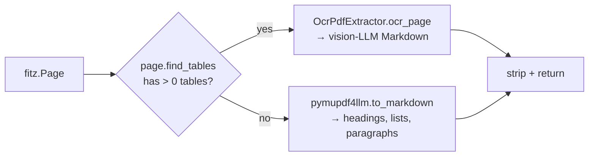
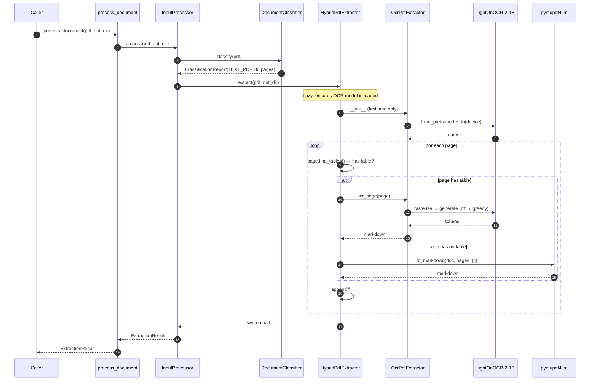

# Input Module — Architecture

The input module implements **Stage 2 (Pre-processing)** of the [Pipeline Design](Pipeline%20Design.md). It accepts a financial document (text PDF / scanned PDF / XBRL), classifies it, and produces page-by-page Markdown that downstream stages (section classifier, vision-LLM extractor) consume.

---

## 1. Responsibilities

| Concern | Owner | Notes |
|---|---|---|
| Format detection | `DocumentClassifier` | Magic bytes, extension, image-coverage analysis |
| Per-page routing | `HybridPdfExtractor` | Decides OCR vs fast text per page |
| Vision OCR | `OcrPdfExtractor` | LightOnOCR-2-1B, rasterized images |
| Fast text → markdown | `pymupdf4llm` | Headings, lists, paragraphs preserved |
| Top-level orchestration | `InputProcessor` | Lazy model loading, single composition root |
| Public API | `process_document()` | Module-level convenience wrapper |
| Data contract | `ExtractionResult`, `DocumentClass` | Stable shape consumed downstream |

---

## 2. Public API

```python
from input_module import process_document
from pathlib import Path

result = process_document(
    Path("filing.pdf"),
    Path("./out"),
)
# result.document_class    → DocumentClass.TEXT_PDF | SCANNED_PDF | XBRL
# result.markdown_path     → Path("./out/filing.md") | None (XBRL)
# result.page_count        → int | None
# result.metadata          → {image_dominant_pages, has_text_layer}
```

For batch jobs that share the OCR model:

```python
from input_module import InputProcessor

processor = InputProcessor()        # OCR model loads on first need
for pdf in pdfs:
    processor.process(pdf, out_dir)
```

---

## 3. Architecture

```mermaid
flowchart TB
    %% ---- Entry ---------------------------------------------------------
    User([Caller]) --> API["process_document(source, output_dir)"]

    subgraph ORCH["Orchestration — processor.py"]
        API --> Proc[InputProcessor.process]
        Proc --> Cls
        Proc --> Disp{document_class?}
    end

    %% ---- Classification ------------------------------------------------
    subgraph CLS["Classification — classifier.py"]
        Cls[DocumentClassifier.classify]
        Cls --> Magic{magic bytes /<br/>extension}
        Magic -- "iXBRL / .xbrl" --> ClassXBRL[/DocumentClass.XBRL/]
        Magic -- "%PDF-" --> Cov[per-page image<br/>coverage analysis]
        Cov --> Rule{image-dominant >= 10<br/>OR no text layer?}
        Rule -- "yes" --> ClassScan[/DocumentClass.SCANNED_PDF/]
        Rule -- "no" --> ClassText[/DocumentClass.TEXT_PDF/]
        Magic -- "neither" --> Err[/UnsupportedDocumentError/]
    end

    %% ---- Routing -------------------------------------------------------
    Disp -- "TEXT_PDF" --> Hybrid
    Disp -- "SCANNED_PDF" --> OCR
    Disp -- "XBRL" --> Skip[skip extraction<br/>markdown_path = None]

    %% ---- Extractors ----------------------------------------------------
    subgraph EXT["Extraction — extractors/"]
        Hybrid[HybridPdfExtractor]
        OCR[OcrPdfExtractor]

        subgraph HYBRID_LOOP["Hybrid per-page loop"]
            HasTable{page has table?<br/>(PyMuPDF find_tables)}
            HasTable -- "yes" --> OCRpage[OcrPdfExtractor.ocr_page]
            HasTable -- "no" --> PMU4L["pymupdf4llm.to_markdown<br/>(single page)"]
        end

        Hybrid --> HasTable
        OCRpage -.shared model.-> OCR
    end

    %% ---- Backends ------------------------------------------------------
    subgraph BACK["Backends"]
        FITZ[(PyMuPDF / fitz<br/>raster + text + tables)]
        P4L[(pymupdf4llm<br/>headings + lists + paragraphs)]
        LOCR[(LightOnOCR-2-1B<br/>vision-language OCR)]
    end

    OCR --> FITZ
    OCR --> LOCR
    Hybrid --> FITZ
    PMU4L --> P4L
    Cov --> FITZ

    %% ---- Output --------------------------------------------------------
    OCR --> MdOut[(markdown.md<br/>## Page 1...N)]
    Hybrid --> MdOut
    Skip --> Result
    MdOut --> Result[/ExtractionResult/]
    Result --> User
```

**Key dependencies (DIP):**
- `InputProcessor` depends on `DocumentClassifier`, `OcrPdfExtractor`, and the `TextExtractor` Protocol implemented by `HybridPdfExtractor`. All are injectable for testing.
- `HybridPdfExtractor` depends on `OcrPdfExtractor` (concrete) — it needs the `ocr_page()` method and reuses the loaded model. This is intentional: composition over inheritance.
- The OCR model is **loaded once** per `InputProcessor` instance and shared between the hybrid and full-OCR paths.

---

## 4. File layout

```
src/input_module/
├── __init__.py                  # public API re-exports
├── models.py                    # DocumentClass enum, ExtractionResult
├── classifier.py                # DocumentClassifier, ClassificationReport
├── processor.py                 # InputProcessor facade, process_document()
└── extractors/
    ├── __init__.py
    ├── base.py                  # TextExtractor Protocol (DIP)
    ├── hybrid_pdf.py            # HybridPdfExtractor — per-page routing
    ├── ocr_pdf.py               # OcrPdfExtractor — LightOnOCR-2-1B
    └── text_pdf.py              # TextPdfExtractor — legacy, retained but
                                 #   not used by InputProcessor
```

---

## 5. Component reference

### 5.1 `DocumentClassifier` ([classifier.py](src/input_module/classifier.py))

Pure detection — no extraction. Returns a `ClassificationReport` with the decided class and the evidence used to reach it.

**Constants:**

| Constant | Value | Meaning |
|---|---|---|
| `IMAGE_BLOCK_TYPE` | `1` | PyMuPDF block dict type for image |
| `IMAGE_DOMINANT_COVERAGE` | `0.50` | A page is image-dominant when image area > 50% of page |
| `SCANNED_PAGE_THRESHOLD` | `10` | Document is scanned if ≥ 10 pages are image-dominant |
| `TEXT_LAYER_MIN_CHARS` | `50` | A page has "text layer" if any page has > 50 extractable chars |
| `XBRL_SNIFF_BYTES` | `4096` | First-bytes window for namespace detection |
| `XBRL_MARKERS` | `("<xbrl", "<xbrli:xbrl", "http://www.xbrl.org/", "http://www.w3.org/1999/xhtml")` | Substrings that identify (i)XBRL content |
| `XBRL_EXTENSIONS` | `(".xbrl",)` | Filename extensions accepted as XBRL |

**Algorithm — `classify(source: Path) → ClassificationReport`:**

```text
1. assert source.exists()                                      # else FileNotFoundError
2. if _is_xbrl(source):
       return ClassificationReport(class=XBRL)
3. if _is_pdf(source):
       return _classify_pdf(source)
4. raise UnsupportedDocumentError
```

**Step 2 — `_is_xbrl(source)`:**

```text
1. if source.suffix.lower() in XBRL_EXTENSIONS:    return True   # cheap path
2. head = source.read_bytes()[:XBRL_SNIFF_BYTES].decode("utf-8", errors="ignore")
3. return any(marker in head for marker in XBRL_MARKERS)
```

- The XHTML namespace marker is what catches **iXBRL inline filings** (which ride inside an XHTML document and have a `.htm`/`.html` extension).
- `errors="ignore"` defends against binary garbage in the sniff window.
- I/O errors → return `False` so the caller falls through to the PDF check.

**Step 3 — `_is_pdf(source)`:**

```python
with source.open("rb") as fh:
    return fh.read(5) == b"%PDF-"
```

The `%PDF-` magic is the PDF spec's required header. I/O errors → `False`.

**Step 4 — `_classify_pdf(source)` (the heart of classification):**

```text
with fitz.open(source) as doc:
    page_count       = doc.page_count
    image_dominant   = sum(1 for page in doc if _is_image_dominant(page))
    has_text         = any(_page_has_text(page) for page in doc)

is_scanned = (image_dominant >= 10) OR (not has_text)
class      = SCANNED_PDF if is_scanned else TEXT_PDF
return ClassificationReport(class, page_count, image_dominant, has_text)
```

**Step 4a — `_is_image_dominant(page)`:**

```text
page_area = page.rect.width * page.rect.height
if page_area <= 0: return False                            # defensive

blocks     = page.get_text("dict")["blocks"]
image_area = Σ (x1-x0) * (y1-y0) for each block where block.type == 1

return (image_area / page_area) > 0.50
```

PyMuPDF's `get_text("dict")` returns a structured representation where each block has a `type` field (`0` = text, `1` = image). The bbox of an image block is the rectangle the image occupies on the page after any scaling — exactly what we need.

**Step 4b — `_page_has_text(page)`:**

```python
return len(page.get_text("text").strip()) > 50
```

Strip-then-length avoids counting whitespace as a "text layer". The 50-char threshold is empirical: smaller than the shortest meaningful prose paragraph but larger than headers/page numbers that may live as text on otherwise-scanned pages.

**Why the dual rule (`>= 10 image pages` OR `no text layer`):**

| Document shape | image_dominant | has_text | Old "10+" only | Final rule |
|---|---:|:-:|:-:|:-:|
| Native text 10-K, all prose | 0 | ✓ | TEXT_PDF | TEXT_PDF |
| Native text 10-K, embedded chart images | 2 | ✓ | TEXT_PDF | TEXT_PDF |
| Mixed filing, many chart pages | 12 | ✓ | SCANNED_PDF | SCANNED_PDF |
| Long scanned filing | 30 | ✗ | SCANNED_PDF | SCANNED_PDF |
| **Short scanned filing (4 pages)** | 4 | ✗ | TEXT_PDF (wrong) | **SCANNED_PDF** |

The OR fallback closes the short-scanned-filing loophole.

### 5.2 `InputProcessor` ([processor.py](src/input_module/processor.py))

The composition root. Lazily constructs the OCR extractor (so callers that only ever process XBRL or use injected extractors don't pay the model-load cost) and the hybrid extractor (which reuses the same OCR instance).

Constructor accepts injected dependencies for tests:

```python
InputProcessor(
    classifier:        Optional[DocumentClassifier]   = None,
    ocr_extractor:     Optional[OcrPdfExtractor]      = None,
    hybrid_extractor:  Optional[TextExtractor]        = None,
)
```

`process(source, output_dir) → ExtractionResult` is the only entry point. `_extract` dispatches by `document_class`:

| Class | Extractor | Notes |
|---|---|---|
| `TEXT_PDF` | `HybridPdfExtractor` | Per-page table-aware routing |
| `SCANNED_PDF` | `OcrPdfExtractor` | All pages OCR'd |
| `XBRL` | None — `markdown_path = None` | Classification only; parsing deferred |

### 5.3 `HybridPdfExtractor` ([hybrid_pdf.py](src/input_module/extractors/hybrid_pdf.py))

Iterates pages of a text PDF and routes each one based on table presence.



**Why this hybrid:**

- Tables in financial filings carry the highest signal density. Cell adjacency, scale annotations, and parenthetical signs are mangled by flat text extraction. OCR with a vision model preserves them.
- Prose pages (MD&A, narrative sections, footnote text) don't benefit from OCR — `pymupdf4llm` returns clean markdown in milliseconds. OCR'ing them would waste 30–90 s per page on MPS.

**Algorithm — `extract(source, output_dir) → Path`:**

```text
1. assert source.exists()                                       # else FileNotFoundError
2. output_dir.mkdir(parents=True, exist_ok=True)
3. output_path = output_dir / f"{source.stem}.md"
4. output_path.write_text(_render_markdown(source))
5. return output_path
```

**Algorithm — `_render_markdown(source)`:**

```text
sections = []
with fitz.open(source) as doc:
    total = doc.page_count
    for i, page in enumerate(doc, start=1):
        mode = "ocr" if _page_has_table(page) else "text"
        print(f"[{mode}] page {i}/{total} starting...", flush=True)
        t0 = perf_counter()
        content = _render_page(page, mode)
        sections.append(f"## Page {i}\n\n{content}")
        print(f"[{mode}] page {i}/{total} done in {perf_counter()-t0:.1f}s")
return "\n\n".join(sections) + "\n"
```

The `mode` decision is made **once** per page so `find_tables()` is not invoked twice (once for the route, once for the log line). `_render_page` accepts the pre-computed mode.

**Algorithm — `_page_has_table(page)`:**

```python
try:
    return len(list(page.find_tables().tables)) > 0
except Exception:
    return False  # any detector failure → safer to take the fast text path
```

The broad `except` is deliberate: PyMuPDF's table detector occasionally raises on malformed PDFs (orphan font references, broken xref tables). Falling back to the text path is the right default — worst case the page renders as paragraphs without table structure, which is degraded but not corrupt.

**Algorithm — `_render_page(page, mode)`:**

```text
if mode == "ocr":
    return self._ocr_extractor.ocr_page(page).strip()
else:
    return _extract_markdown(page)
```

**Algorithm — `_extract_markdown(page)` (the text path):**

```python
markdown = pymupdf4llm.to_markdown(
    page.parent,                # the open Document — no second open() call
    pages=[page.number],        # single page
    show_progress=False,
)
return markdown.strip().strip("-").strip()
```

The trailing `.strip("-").strip()` defends against `pymupdf4llm`'s page-separator markers (`-----`) that some library versions emit at page boundaries — we already provide our own `## Page N` heading, so any stray separators would just look like horizontal-rule noise.

**Per-page output is wrapped** in `## Page N\n\n{content}` to preserve source-page traceability for downstream lineage. This contract is identical between hybrid and full-OCR paths so the consumer never needs to know which one ran.

### 5.4 `OcrPdfExtractor` ([ocr_pdf.py](src/input_module/extractors/ocr_pdf.py))

LightOnOCR-2-1B inference loop. Loads the model on `__init__` and exposes both:

- `extract(source, output_dir) → Path` — full document, all pages OCR'd (used for SCANNED_PDF).
- `ocr_page(page) → str` — single-page OCR (used by hybrid extractor for table pages).

**Key configuration:**

| Constant | Value | Rationale |
|---|---|---|
| `DEFAULT_MODEL_ID` | `lightonai/LightOnOCR-2-1B` | Per design |
| `DEFAULT_DPI` | `200` | Speed/accuracy trade — model rescales internally |
| `DEFAULT_MAX_NEW_TOKENS` | `4096` | Covers most dense pages; bumpable per-instance |
| `MIN_DPI` | `150` | Floor for raster quality |
| dtype (MPS + CUDA) | `bfloat16` | Same dynamic range as fp32, half the memory; avoids softmax overflow |

**Algorithm — `__init__(model_id, dpi, max_new_tokens, device)`:**

```text
1. assert dpi >= MIN_DPI                                        # else ValueError
2. self._device = device or _select_device()                    # MPS → CUDA → CPU
3. self._dtype  = torch.bfloat16
4. print("Loading {model_id}...")
5. self._model     = LightOnOcrForConditionalGeneration
                     .from_pretrained(model_id, torch_dtype=bf16)
                     .to(self._device)
6. self._processor = LightOnOcrProcessor.from_pretrained(model_id)
7. print(f"Model loaded in {elapsed:.1f}s")
```

**Algorithm — `extract(source, output_dir) → Path`:**

Same shape as `HybridPdfExtractor.extract`: validate, mkdir, write `_render_markdown(source)` to disk, return path.

**Algorithm — `_render_markdown(source)`:**

```text
sections = []
with fitz.open(source) as doc:
    total = doc.page_count
    for i, page in enumerate(doc, start=1):
        print(f"[ocr] page {i}/{total} starting...")
        t0 = perf_counter()
        content = ocr_page(page).strip()
        sections.append(f"## Page {i}\n\n{content}")
        print(f"[ocr] page {i}/{total} done in {perf_counter()-t0:.1f}s")
return "\n\n".join(sections) + "\n"
```

**Algorithm — `ocr_page(page) → str` (per-page inference):**

```text
1. image = _rasterize(page)                       # PIL.Image at self._dpi
2. text  = _ocr_image(image)
3. return text
```

**Algorithm — `_rasterize(page) → PIL.Image`:**

```python
pixmap = page.get_pixmap(dpi=self._dpi)
return Image.open(io.BytesIO(pixmap.tobytes("png"))).convert("RGB")
```

The PNG round-trip is intentional — it normalises colour space and strips alpha so the processor sees a clean RGB tensor.

**Algorithm — `_ocr_image(image) → str` (the hot loop):**

```text
1. conversation = [
     {"role": "user",
      "content": [{"type": "image", "image": image}]}]

2. inputs = processor.apply_chat_template(
       conversation,
       add_generation_prompt=True,
       tokenize=True,
       return_dict=True,
       return_tensors="pt")

3. inputs = {k: v.to(device, dtype=bf16) if v.is_floating_point()
                 else v.to(device)
             for k, v in inputs.items()}

4. try:
       with torch.inference_mode():
           output_ids = model.generate(
               **inputs,
               max_new_tokens=self._max_new_tokens,
               do_sample=False)         # greedy
           prompt_len    = inputs["input_ids"].shape[1]
           generated_ids = output_ids[0, prompt_len:].detach().cpu()
       return processor.decode(generated_ids, skip_special_tokens=True)

5. finally:
       del inputs, output_ids, generated_ids
       _free_device_cache()             # mps.empty_cache or cuda.empty_cache
```

**Memory discipline — why each step matters:**

| Step | Without it | With it |
|---|---|---|
| `inference_mode()` | Autograd graph builds for every op; multi-GB held until GC | Graph never built; flat memory |
| `.detach().cpu()` | Generated tensor held on device until next `generate()` | Output tensor leaves the device immediately |
| `del inputs, output_ids, generated_ids` | Local references keep tensors alive until function exit | References dropped before `empty_cache` |
| `torch.mps.empty_cache()` / `torch.cuda.empty_cache()` | Pooled allocator never returns memory to OS | Pool resets between pages — bounded peak usage |

Without these four steps, MPS memory grows monotonically and OOMs at ~10–20 pages. With them, peak usage is bounded by `model_weights + one_page_kv_cache`.

**Why `do_sample=False` (greedy):**

- OCR is a transcription task — we want the most-likely token at each step, not a sampled one.
- Greedy decoding avoids `torch.multinomial`, which fails with `RuntimeError: probability tensor contains either inf, nan or element < 0` if any softmax overflows on bf16/fp16.
- Output becomes deterministic — same input → same Markdown across runs. Useful for reproducibility and diff-based regression testing.

**Why `bfloat16` (not float16, not float32):**

| dtype | Range | Mantissa | Memory | MPS support | Risk |
|---|---|---|---|---|---|
| `float32` | ±3.4e38 | 23 bit | 4 B/param | full | safest, slowest |
| `float16` | ±6.5e4 | 10 bit | 2 B/param | full | softmax overflow → inf/nan |
| `bfloat16` | ±3.4e38 | 7 bit | 2 B/param | PyTorch ≥ 2.4 | small precision loss in attention |

bf16 keeps fp32's dynamic range (no overflow) while halving the memory and roughly doubling throughput on supported devices. It's the standard inference dtype for transformer models on CUDA, and PyTorch's MPS backend has supported it since 2.4.

**Device selection (auto):** MPS → CUDA → CPU.

```python
def _select_device():
    if torch.backends.mps.is_available(): return "mps"
    if torch.cuda.is_available():         return "cuda"
    return "cpu"
```

CPU works but is unusable in practice (single-page OCR can take 10+ minutes). The device can be overridden via `OcrPdfExtractor(device="cpu")` for tests.

### 5.5 Data contracts ([models.py](src/input_module/models.py))

```python
class DocumentClass(str, Enum):
    TEXT_PDF    = "text_pdf"
    SCANNED_PDF = "scanned_pdf"
    XBRL        = "xbrl"

class ExtractionResult(BaseModel):
    document_class: DocumentClass
    source_path:    Path
    markdown_path:  Optional[Path]    # None for XBRL
    page_count:     Optional[int]
    metadata:       dict              # image_dominant_pages, has_text_layer
```

Free-form `metadata` lets extractors emit diagnostic fields without breaking the contract.

---

## 6. Validation Rules and Quality Checks

This section catalogs every check the input module performs, in the order it performs them. Each rule is paired with the file/function that owns it and the failure mode it catches.

### 6.1 Pre-classification — file-level validation

| Rule | Owner | Effect on failure |
|---|---|---|
| File must exist on disk | `DocumentClassifier.classify` | `FileNotFoundError` |
| File must be readable as bytes | `DocumentClassifier._is_xbrl` | I/O error treated as "not XBRL"; falls through to PDF check |
| File must be PDF or XBRL | `DocumentClassifier.classify` | `UnsupportedDocumentError` |

### 6.2 XBRL detection rules — `DocumentClassifier._is_xbrl`

A file is XBRL iff **any** of the following match (short-circuited in order):

| # | Rule | Cost |
|---|---|---|
| 1 | Filename extension is in `XBRL_EXTENSIONS = (".xbrl",)` (case-insensitive) | O(1) |
| 2 | First `XBRL_SNIFF_BYTES = 4096` bytes contain `"<xbrl"` | one read |
| 3 | First 4 KB contain `"<xbrli:xbrl"` (qualified root element) | same read |
| 4 | First 4 KB contain `"http://www.xbrl.org/"` (XBRL namespace URI) | same read |
| 5 | First 4 KB contain `"http://www.w3.org/1999/xhtml"` (catches **iXBRL**, which is hosted in XHTML) | same read |

The XHTML rule may produce a small number of false positives on non-XBRL XHTML documents, but that's an acceptable trade — the alternative (full XML parse on every input) is far too expensive for a sniff step.

### 6.3 PDF detection rules — `DocumentClassifier._is_pdf`

| # | Rule |
|---|---|
| 1 | First 5 bytes equal `b"%PDF-"` (the PDF spec's required magic) |

Anything else → fall through to `UnsupportedDocumentError`.

### 6.4 PDF classification rules — `DocumentClassifier._classify_pdf`

Decision is `is_scanned = (image_dominant_pages >= 10) OR (not has_text_layer)`.

**Image-dominant page rule (`_is_image_dominant`):**

| # | Rule |
|---|---|
| 1 | `page_area = page.rect.width × page.rect.height`; if `<= 0`, page is **not** image-dominant (defensive) |
| 2 | Iterate `page.get_text("dict")["blocks"]`, sum bbox areas where `block["type"] == 1` (image) |
| 3 | Page is image-dominant iff `(image_area / page_area) > IMAGE_DOMINANT_COVERAGE = 0.50` |

**Text-layer rule (`_page_has_text`):**

| # | Rule |
|---|---|
| 1 | A page has text iff `len(page.get_text("text").strip()) > TEXT_LAYER_MIN_CHARS = 50` |
| 2 | The document has a text layer iff **any** page passes rule 1 |

### 6.5 OCR configuration validation — `OcrPdfExtractor.__init__`

| # | Rule | Effect on failure |
|---|---|---|
| 1 | `dpi >= MIN_DPI = 150` | `ValueError("DPI must be >= 150 for OCR, got {dpi}")` |
| 2 | `model_id` is loadable by HuggingFace | Whatever `from_pretrained` raises (typically `OSError` or `RepositoryNotFoundError`) |
| 3 | `device` is a valid PyTorch device string when explicitly passed | `RuntimeError` from `.to(device)` |
| 4 | `max_new_tokens > 0` (caller responsibility — not enforced) | Silent: zero tokens generated |

### 6.6 Per-page input validation — `Hybrid` and `Ocr` extractors

| # | Rule | Owner |
|---|---|---|
| 1 | `source.exists()` before opening | `extract()` (both extractors) |
| 2 | `output_dir` is creatable (`mkdir(parents=True, exist_ok=True)`) | `extract()` (both extractors) |
| 3 | `page.find_tables()` either returns or raises — exceptions are caught and treated as "no table" | `HybridPdfExtractor._page_has_table` |
| 4 | OCR generation runs under `torch.inference_mode()` to avoid graph-tracking memory leaks | `OcrPdfExtractor._ocr_image` |
| 5 | Device cache is cleared in a `finally` so a failed page does not leak memory into the next page | `OcrPdfExtractor._ocr_image` |

### 6.7 OCR output rules — `OcrPdfExtractor._ocr_image`

| # | Rule |
|---|---|
| 1 | Generation uses `do_sample=False` (greedy) — no `torch.multinomial`, no `inf/nan` sampling failures |
| 2 | Output tokens are sliced from `prompt_len` onward — the prompt itself is never echoed |
| 3 | Generated ids are `.detach().cpu()` before decoding — ensures the device tensor is released |
| 4 | Decoding uses `skip_special_tokens=True` — `<image>`, `<eos>`, etc. are stripped |

### 6.8 Hybrid output rules — `HybridPdfExtractor._extract_markdown`

| # | Rule |
|---|---|
| 1 | `pymupdf4llm.to_markdown` runs with `show_progress=False` to keep stdout clean |
| 2 | Only the requested page is processed (`pages=[page.number]`) — no whole-document re-parse |
| 3 | Output is `.strip().strip("-").strip()` — the inner `.strip("-")` removes any `-----` page-break markers some `pymupdf4llm` versions emit |

### 6.9 Legacy table-quality checks — `TextPdfExtractor` (dormant code path)

These checks are **not** invoked in the active pipeline (text PDFs now go through the hybrid extractor + `pymupdf4llm`). Documented for completeness because the code is retained in [text_pdf.py](src/input_module/extractors/text_pdf.py) and may be revived if `pymupdf4llm` proves insufficient for some layouts.

The legacy extractor uses a three-level fallback (PyMuPDF → pdfplumber → pdfminer) and a quality-validation function `_table_quality_ok(rows)` that returns `True` only when **all four** of the following pass:

**Check A — merged comma-numbers in one cell:**

```python
_MERGED_NUMBER_RE = re.compile(r"[-]?\d[\d]*,\d[\d,]*\s+[-]?\d[\d]*,\d[\d,]*")
```

Catches cells like `"20,891 16,723"` or `"-5,828 -5,771"` where two financial values were merged into one cell because column boundaries were missed. Requires commas in **both** numbers so date fragments like `"25 31"` (from `"30 Jun. 25 31 Dec. 24"`) do not false-positive.

**Check B — comma-number + label word merged:**

```python
_COMMA_NUMBER_RE = re.compile(r"[-]?\d[\d]*,\d[\d,]*")
_WORD_RE         = re.compile(r"[A-Za-z]{4,}")

if _COMMA_NUMBER_RE.search(cell) and _WORD_RE.search(cell):
    fail Check B
```

Catches cells like `"75,565 Deposits from banks"` where a row-label and a value have collapsed into one cell.

**Check C — ragged column counts:**

```text
fail if max(len(row) for row in rows) - min(...) > _MAX_RAGGED_COL_DIFF (= 2)
```

Catches tables where extraction produced rows of inconsistent width.

**Check D — collapsed rows in one cell:**

```text
fail if any cell.count("\n") > _MAX_NEWLINES_PER_CELL (= 4)
```

Catches the structural failure where an entire column's content gets stuffed into a single multi-line cell. Empty cells dilute Checks A and B but cannot mask this one — newline counting is independent of cell-population density.

**Failure-rate metric (`_failure_rate`):**

```text
populated  = count of cells where bool(cell) is True
failed     = count of populated cells failing Check A, B, or D
return failed / populated     # zero if populated == 0
```

The denominator excludes empty cells. A table with 70% empty cells and 30% corrupt cells would otherwise look "9% bad" by total-cell counting; using populated cells gives the honest 30%.

**Fallback acceptance threshold:**

| Outcome | Action |
|---|---|
| Some extractor passes all four checks | Use it immediately |
| All extractors fail; lowest `_failure_rate < 0.30` | Use the best one (best-effort) |
| All extractors fail and best rate ≥ 0.30 | Return `[]` — caller emits the region as plain text |

---

## 7. Error Handling and Exceptions

| Exception | Where raised | When | Caller recovery |
|---|---|---|---|
| `FileNotFoundError` | `DocumentClassifier.classify`, `extract()` of either extractor | `source` does not exist | Callers must validate input paths upstream |
| `UnsupportedDocumentError` (subclass of `ValueError`) | `DocumentClassifier.classify` | File is neither PDF nor XBRL | Catch and skip; log for ops review |
| `ValueError` | `OcrPdfExtractor.__init__` | `dpi < MIN_DPI` | Pass a valid DPI |
| `OSError` | Underlying I/O during `from_pretrained`, `read_bytes`, `write_text` | Network/disk failures | Retry or abort |
| `RuntimeError` (PyTorch) | `OcrPdfExtractor._ocr_image` | OOM, device errors, dtype mismatches | Caught by `try/finally`; the `finally` always runs `_free_device_cache()` so subsequent pages start clean. The exception itself propagates |
| Generic `Exception` (caught) | `HybridPdfExtractor._page_has_table` | PyMuPDF table detector fails on a malformed page | Treated as "no table" → fast text path. Page is preserved, just without table semantics |
| Generic `Exception` (caught) | `TextPdfExtractor._extract_tables_with_fallback` (legacy) | Any extractor backend raises | Try the next backend; if all fail, return `[]` |

**Design principle on error handling:**

- **Validation errors** (bad inputs, unsupported formats) → raise immediately with a specific exception class. Callers can branch on type.
- **Best-effort errors** (one of N table backends crashed) → catch narrowly, log, fall back. The user gets degraded output, not a crash.
- **Resource-cleanup errors** are swallowed inside `finally` blocks because letting them escape would mask the original exception.

---

## 8. Output format

Every PDF (text or scanned) produces one Markdown file at `output_dir/{stem}.md` with this structure:

```markdown
## Page 1

{markdown for page 1 — headings, lists, paragraphs, or OCR table HTML/MD}

## Page 2

{markdown for page 2}

...
```

Each page's content is the raw output of either `pymupdf4llm.to_markdown` (text path) or LightOnOCR (OCR path). Page boundaries are preserved so downstream stages can attach extracted facts back to a specific page.

---

## 9. Performance characteristics

Measured on Apple M-series MPS, LightOnOCR-2-1B in bf16, `DEFAULT_DPI=200`:

| Operation | Latency |
|---|---|
| Classifier (full document scan) | < 1 s for typical 30-page filing |
| Hybrid: text page (`pymupdf4llm`) | ~50 ms |
| Hybrid: OCR page (table) | 30–90 s |
| Full OCR (every page) | 30–90 s × N pages |
| Model load (cached weights) | ~30–60 s on MPS |
| Model download (first run) | ~3–5 min depending on bandwidth |

A typical 10-Q with ~25 prose pages and ~5 table pages: **~5–10 min total** in hybrid mode vs **~25–60 min** in full-OCR mode.

**Memory:** ~4 GB for model weights in bf16, plus ~1–2 GB working set during generation. Safe on machines with ≥ 16 GB unified memory; on lower-memory systems, lower `DEFAULT_MAX_NEW_TOKENS`.

---

## 10. Extension points

**Adding a new format (PPTX, XLSX, HTML):**
1. Add a value to `DocumentClass`.
2. Detect it in `DocumentClassifier.classify` (extension + magic bytes).
3. Implement a new class conforming to the `TextExtractor` Protocol (`extract(source, output_dir) → Path`).
4. Wire it in `InputProcessor._extract`.

The Protocol-based dispatch is the OCP boundary — no other code needs to change.

**Swapping the OCR model:**
Pass a different `model_id` to `OcrPdfExtractor.__init__`, or inject a custom `OcrPdfExtractor` subclass via `InputProcessor(ocr_extractor=...)`. The HF processor and chat template are constructor-bound, so models with different prompt formats need a custom subclass.

**XBRL extraction (currently deferred):**
Implement an `XbrlExtractor` conforming to the same Protocol, add a `_get_xbrl_extractor()` lazy field on `InputProcessor`, and route `DocumentClass.XBRL` to it in `_extract`. Recommended backend: Arelle (reference impl) for instance + linkbase parsing.

**Per-page progress hook:**
Both extractors print `[mode] page N/total starting/done` lines to stdout. Replace with the `logging` module if structured logging is required.

---

## 11. Known limitations

| Limitation | Mitigation / Workaround |
|---|---|
| MPS throughput on a 2B VLM is fundamentally slow (~30–90 s/page) | Run on CUDA (10–50× speedup); run smaller model; use vLLM with batching |
| `find_tables()` misses borderless / partially-bordered tables | Page is routed to fast text path → tables emerge as flat text. Fix: tighten table heuristics or always-OCR for known-table pages |
| OCR token cap (`max_new_tokens=4096`) can truncate dense pages | Bump per-instance: `OcrPdfExtractor(max_new_tokens=8192)` |
| XBRL not extracted, only classified | See §8; planned, not yet implemented |
| `pymupdf4llm` may emit `-----` page separators | Stripped at the boundary in `_extract_markdown`. If new versions add other artifacts, extend the strip |
| Model download on first run is silent | First print after `process_document()` is `Loading {model_id}...`; download progress comes from HF Hub directly |
| No cross-PDF caching | Each `InputProcessor` instance loads its own model. Reuse one instance for batch jobs |

---

## 12. Dependencies

| Package | Version | Used by | Purpose |
|---|---|---|---|
| `pymupdf` (`fitz`) | `>=1.24` | classifier, hybrid_pdf, ocr_pdf | Page geometry, raster, text, table detection |
| `pymupdf4llm` | `>=0.0.17` | hybrid_pdf | PDF → Markdown for non-table pages |
| `transformers` | `>=5.0.0` | ocr_pdf | LightOnOCR model + processor |
| `torch` | `>=2.1` | ocr_pdf | Model runtime; `>=2.4` recommended for MPS bf16 |
| `Pillow` | `>=10.0` | ocr_pdf | Pixmap → PIL Image conversion |
| `accelerate` | `>=0.30` | ocr_pdf | HF model loading utilities |
| `pydantic` | `>=2.0` | models | `ExtractionResult` data contract |

`pdfplumber`, `pdfminer.six`, `pandas`, `tabulate` are present in [requirements.txt](requirements.txt) but only used by the legacy `TextPdfExtractor` (not in the active code path). Safe to remove if `TextPdfExtractor` is deleted.

---

## 13. Sequence — happy path for a text PDF



---

## 14. Glossary

- **Image-dominant page** — a PDF page where the sum of image-block bbox areas exceeds 50% of the page area. Used to identify scanned content.
- **Text layer** — extractable text via PyMuPDF's `get_text("text")`. Absent in image-only PDFs (scanned filings).
- **Hybrid mode** — per-page routing in `HybridPdfExtractor`: tables go to OCR, prose goes to fast markdown extraction.
- **Greedy decoding** — `do_sample=False` in `model.generate()`. Picks the highest-probability token at each step. Deterministic, faster than sampling.
- **bf16 / bfloat16** — 16-bit float with the dynamic range of fp32 (8-bit exponent) but reduced mantissa precision. Avoids softmax overflow that plain fp16 can trigger.
- **Composition root** — the single place where dependencies are wired together. In this module, that's `InputProcessor.__init__`.
