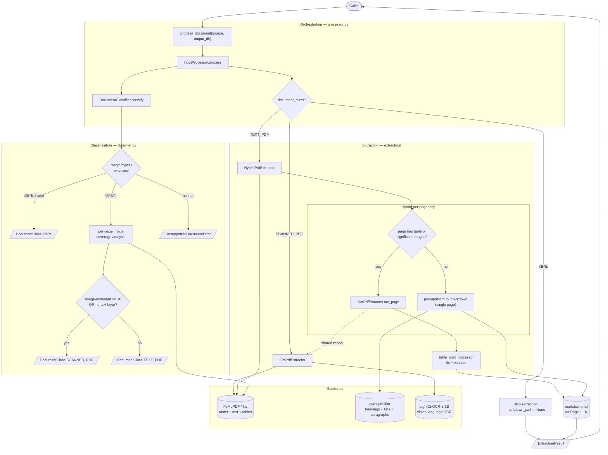
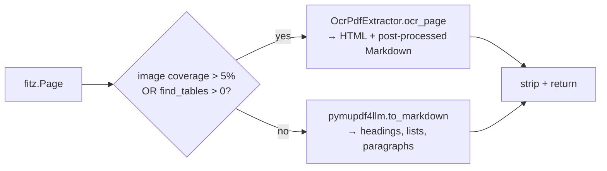
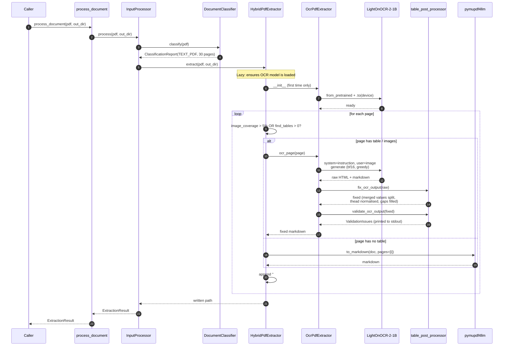

# Input Module — Architecture

The input module implements **Stage 2 (Pre-processing)** of the [Pipeline Design](Pipeline%20Design.md). It accepts a financial document (text PDF / scanned PDF / XBRL), classifies it, and produces page-by-page Markdown that downstream stages (section classifier, vision-LLM extractor) consume.

---

## 1. Responsibilities

| Concern | Owner | Notes |
|---|---|---|
| Format detection | `DocumentClassifier` | Magic bytes, extension, image-coverage analysis |
| Per-page routing | `HybridPdfExtractor` | Decides OCR vs fast text per page |
| Vision OCR | `OcrPdfExtractor` | LightOnOCR-2-1B, rasterized images, HTML table output |
| Table post-processing | `table_post_processor` | Merged-value split, thead normalisation, grid gap fill, validation |
| Fast text → markdown | `pymupdf4llm` | Headings, lists, paragraphs preserved |
| Top-level orchestration | `InputProcessor` | Lazy model loading, single composition root |
| Public API | `process_document()` | Module-level convenience wrapper |
| Data contract | `ExtractionResult`, `DocumentClass` | Stable shape consumed downstream |

---

## 2. Public API

```python
from input_module import process_document
from pathlib import Path

result = process_document(
    Path("filing.pdf"),
    Path("./out"),
)
# result.document_class    → DocumentClass.TEXT_PDF | SCANNED_PDF | XBRL
# result.markdown_path     → Path("./out/filing.md") | None (XBRL)
# result.page_count        → int | None
# result.metadata          → {image_dominant_pages, has_text_layer}
```

For batch jobs that share the OCR model:

```python
from input_module import InputProcessor

processor = InputProcessor()        # OCR model loads on first need
for pdf in pdfs:
    processor.process(pdf, out_dir)
```

Post-processor functions are also exported for standalone use (e.g. notebook inspection):

```python
from input_module.extractors import fix_ocr_output, validate_ocr_output, ValidationIssue
```

---

## 3. Architecture



**Key dependencies (DIP):**
- `InputProcessor` depends on `DocumentClassifier`, `OcrPdfExtractor`, and the `TextExtractor` Protocol implemented by `HybridPdfExtractor`. All are injectable for testing.
- `HybridPdfExtractor` depends on `OcrPdfExtractor` (concrete) — it needs the `ocr_page()` method and reuses the loaded model. This is intentional: composition over inheritance.
- The OCR model is **loaded once** per `InputProcessor` instance and shared between the hybrid and full-OCR paths.

---

## 4. File layout

```
src/input_module/
├── __init__.py                  # public API re-exports
├── models.py                    # DocumentClass enum, ExtractionResult
├── classifier.py                # DocumentClassifier, ClassificationReport
├── processor.py                 # InputProcessor facade, process_document()
└── extractors/
    ├── __init__.py              # exports incl. fix_ocr_output, ValidationIssue
    ├── base.py                  # TextExtractor Protocol (DIP)
    ├── hybrid_pdf.py            # HybridPdfExtractor — per-page routing
    ├── ocr_pdf.py               # OcrPdfExtractor — LightOnOCR-2-1B
    ├── table_post_processor.py  # 3-stage table fix + validation pipeline
    └── text_pdf.py              # TextPdfExtractor — legacy, retained but
                                 #   not used by InputProcessor
```

---

## 5. Component reference

### 5.1 `DocumentClassifier` ([classifier.py](src/input_module/classifier.py))

Pure detection — no extraction. Returns a `ClassificationReport` with the decided class and the evidence used to reach it.

**Constants:**

| Constant | Value | Meaning |
|---|---|---|
| `IMAGE_BLOCK_TYPE` | `1` | PyMuPDF block dict type for image |
| `IMAGE_DOMINANT_COVERAGE` | `0.50` | A page is image-dominant when image area > 50% of page |
| `SCANNED_PAGE_THRESHOLD` | `10` | Document is scanned if ≥ 10 pages are image-dominant |
| `TEXT_LAYER_MIN_CHARS` | `50` | A page has "text layer" if any page has > 50 extractable chars |
| `XBRL_SNIFF_BYTES` | `4096` | First-bytes window for namespace detection |
| `XBRL_MARKERS` | `("<xbrl", "<xbrli:xbrl", "http://www.xbrl.org/", "http://www.w3.org/1999/xhtml")` | Substrings that identify (i)XBRL content |
| `XBRL_EXTENSIONS` | `(".xbrl",)` | Filename extensions accepted as XBRL |

**Algorithm — `classify(source: Path) → ClassificationReport`:**

```text
1. assert source.exists()                                      # else FileNotFoundError
2. if _is_xbrl(source):
       return ClassificationReport(class=XBRL)
3. if _is_pdf(source):
       return _classify_pdf(source)
4. raise UnsupportedDocumentError
```

**Step 2 — `_is_xbrl(source)`:**

```text
1. if source.suffix.lower() in XBRL_EXTENSIONS:    return True   # cheap path
2. head = source.read_bytes()[:XBRL_SNIFF_BYTES].decode("utf-8", errors="ignore")
3. return any(marker in head for marker in XBRL_MARKERS)
```

**Step 3 — `_is_pdf(source)`:**

```python
with source.open("rb") as fh:
    return fh.read(5) == b"%PDF-"
```

**Step 4 — `_classify_pdf(source)` (the heart of classification):**

```text
with fitz.open(source) as doc:
    page_count       = doc.page_count
    image_dominant   = sum(1 for page in doc if _is_image_dominant(page))
    has_text         = any(_page_has_text(page) for page in doc)

is_scanned = (image_dominant >= 10) OR (not has_text)
class      = SCANNED_PDF if is_scanned else TEXT_PDF
return ClassificationReport(class, page_count, image_dominant, has_text)
```

### 5.2 `InputProcessor` ([processor.py](src/input_module/processor.py))

The composition root. Lazily constructs the OCR extractor and hybrid extractor.

| Class | Extractor | Notes |
|---|---|---|
| `TEXT_PDF` | `HybridPdfExtractor` | Per-page table-aware routing |
| `SCANNED_PDF` | `OcrPdfExtractor` | All pages OCR'd |
| `XBRL` | None — `markdown_path = None` | Classification only; parsing deferred |

### 5.3 `HybridPdfExtractor` ([hybrid_pdf.py](src/input_module/extractors/hybrid_pdf.py))

Iterates pages of a text PDF and routes each one based on table or image presence.



**`_page_has_table(page)` — two-signal detection:**

```text
1. _page_has_significant_images(page):
       image_area / page_area > 0.05  →  True   # any image coverage > 5% → OCR
2. bool(list(page.find_tables().tables))         # vector table detection
```

The image-coverage signal is new vs the original design — it catches scanned or image-embedded tables that PyMuPDF's vector-line table finder would miss.

### 5.4 `OcrPdfExtractor` ([ocr_pdf.py](src/input_module/extractors/ocr_pdf.py))

LightOnOCR-2-1B inference loop with post-processing. Loads the model on `__init__` and exposes:

- `extract(source, output_dir) → Path` — full document, all pages OCR'd.
- `ocr_page(page) → str` — single-page OCR + post-process (used by hybrid extractor).

**Key configuration:**

| Constant | Value | Rationale |
|---|---|---|
| `DEFAULT_MODEL_ID` | `lightonai/LightOnOCR-2-1B` | Per design |
| `DEFAULT_DPI` | `300` | Rasterisation resolution |
| `DEFAULT_MAX_NEW_TOKENS` | `4096` | Covers most dense pages |
| `MIN_DPI` | `200` | Floor for raster quality |
| dtype | `bfloat16` | fp32 dynamic range, half the memory |

**OCR instruction (system role):**

The instruction is delivered as a `system` role message so the model treats it as behavioural guidance and never echoes it into the generated text. It directs the model to:

1. **HTML table output** — all tables as `<table>/<thead>/<tbody>/<tr>/<th>/<td>`.
2. **Multi-level headers** — spanning headers use `colspan`; sub-headers in a second `<tr>` inside `<thead>`. No flattening.
3. **Column count** — every `<tbody><tr>` must have exactly as many `<td>` cells as the leaf header row.
4. **One value per cell** — `|` inside a `<td>` is never a column separator.
5. **Preserve data** — all numbers, signs, parentheses, dashes copied verbatim.
6. **Empty cells** — blank cells use `<td></td>`, never omitted.

**Algorithm — `ocr_page(page) → str`:**

```text
1. image  = _rasterize(page)           # PIL.Image at self._dpi
2. raw    = _ocr_image(image)          # LightOnOCR inference
3. fixed  = fix_ocr_output(raw)        # table_post_processor Stage 1-3
4. issues = validate_ocr_output(fixed) # structural checks
5. for issue in issues: print(f"[table-validate] {issue.location}: {issue.message}")
6. return fixed
```

**Algorithm — `_ocr_image(image) → str`:**

```text
1. conversation = [
     {"role": "system", "content": self._OCR_INSTRUCTION},
     {"role": "user",   "content": [{"type": "image", "image": image}]}]

2. inputs = processor.apply_chat_template(
       conversation, add_generation_prompt=True,
       tokenize=True, return_dict=True, return_tensors="pt")

3. inputs = {k: v.to(device, dtype=bf16) if v.is_floating_point()
                 else v.to(device)
             for k, v in inputs.items()}

4. with torch.inference_mode():
       output_ids    = model.generate(**inputs, max_new_tokens=..., do_sample=False)
       prompt_len    = inputs["input_ids"].shape[1]
       generated_ids = output_ids[0, prompt_len:].detach().cpu()
   return processor.decode(generated_ids, skip_special_tokens=True)

5. finally: del inputs, output_ids, generated_ids; _free_device_cache()
```

**Why system role for instructions:**

Placing the OCR rules in a `system` message prevents the model from echoing them into the generated content. When the instruction was delivered as `user` content (old behaviour), the rule text would occasionally appear inline between table sections in the output.

### 5.5 `TablePostProcessor` ([table_post_processor.py](src/input_module/extractors/table_post_processor.py))

Three-stage deterministic pipeline that runs on every page after OCR. No LLM call.

**Grid cell model:**

```python
@dataclass
class _Cell:
    tag: str      # "th" or "td"
    attrs: str    # attribute string from the opening tag
    content: str  # inner HTML content
    colspan: int = 1
    rowspan: int = 1

_OCCUPIED = object()  # sentinel: position covered by a span from another cell
```

---

#### Stage 1 — Merged-value split (inside `_parse_rows`)

Detects and splits financial values the model merged into one `<td>`:

```
"$ 2,489 | $ 894"  →  ["$ 2,489", "$ 894"]
"(1,031) | (667)"  →  ["(1,031)", "(667)"]
```

Pattern: `(\$?\s*\(?-?[\d,]+(?:\.\d+)?\)?|[-–])\s*\|\s*(\$?\s*\(?-?[\d,]+(?:\.\d+)?\)?|[-–])`

Runs iteratively until no more merges remain (handles triple-merged cells). Applied only to `<td>` cells at parse time so the grid sees the correct cell count from the start.

---

#### Stage 2 — Thead normalisation (`_normalize_thead`)

Fixes multi-row `<thead>` blocks where the model misplaced sub-header cells.

**Guard condition** — only fires when:
```
leaf-row cell count  ==  sum of colspan values in row 1
```

This proves every leaf-row cell is a sub-header under a colspan group, so every non-colspan, non-first row-1 cell is a standalone column.

**Operations when guard passes:**

1. **Remove rowspan** from non-first standalone row-1 cells (those that have neither `colspan` nor rowspan). Removes any **empty artifact cells** (`<th></th>` with no content) the model appended to row 1.

2. **Prepend placeholders** — inserts `standalone_count` empty `<th></th>` cells at the **start** of every sub-header row so Amount/% land in the correct column positions rather than the first available slots.

**Example (5-column table):**

```
Before row 1: Assets(rs=2) | June30(rs=2) | Dec31(rs=2) | Comparison(cs=2)
Before row 2: Amount | %

After row 1:  Assets(rs=2) | June30       | Dec31       | Comparison(cs=2)
After row 2:  <th/> | <th/> | Amount | %
```

Works for any rowspan depth (2, 3, 4 …) because stripping rowspan turns those positions into `None` gaps that Stage 3 fills automatically.

**Stage 2b — % sub-header alignment (`_align_pct_subheader`):**

Data-driven safety net. After Stage 2, scans `<tbody>` to find which column contains the most numeric `%` values, compares that to the `%` sub-header position, and inserts additional empty `<th></th>` cells if an offset remains.

`_find_pct_col_in_header` accounts for leading rowspan cells in row 1 (e.g. the "Assets" label column with `rowspan=2`) when computing the full table column index, so the comparison is apples-to-apples with `_find_pct_col_in_data`.

---

#### Stage 3 — Grid gap fill (`_build_grid` + `_fill_gaps`)

Simulates the W3C HTML table-forming algorithm over a 2D occupancy grid.

**Grid positions:**

| Value | Meaning |
|---|---|
| `_Cell` instance | Origin of a cell (top-left of its span) |
| `_OCCUPIED` | Covered by rowspan/colspan from another cell |
| `None` | Gap — no cell claimed this position |

**`_build_grid(rows)`** — iterates every `<tr>`, advances past `_OCCUPIED` slots, and fills the cell's `rowspan × colspan` footprint.

**`_fill_gaps(grid, rows, n_cols)`** — replaces every remaining `None` with an empty placeholder matching the row's type:
- Header rows (`row_tag == "th"`) → `<th></th>`
- Body rows (`row_tag == "td"`) → `<td></td>`

`_OCCUPIED` positions are left untouched — the browser handles column placement for spans automatically.

**`_reconstruct_table`** — replaces every `<tr>` block in the original HTML from last to first (preserving earlier character positions) with the fixed cell content. `_OCCUPIED` entries are skipped during emit.

---

#### GFM markdown table fallback

For pages where the model outputs GFM markdown instead of HTML, a separate path (`_fix_markdown_table_alignment`) normalises column counts and expands merged values using the same `_split_merged` logic.

---

#### Public API

```python
def fix_ocr_output(text: str) -> str:
    """Run all three stages. HTML tables fixed in-place; GFM tables normalised."""

fix_markdown_tables = fix_ocr_output   # backward-compat alias

def validate_ocr_output(text: str) -> list[ValidationIssue]:
    """Return structural issues from both HTML and markdown tables."""

validate_markdown_tables = validate_ocr_output   # alias

@dataclass
class ValidationIssue:
    location: str   # e.g. "table 2, row 5"
    message: str
```

### 5.6 Data contracts ([models.py](src/input_module/models.py))

```python
class DocumentClass(str, Enum):
    TEXT_PDF    = "text_pdf"
    SCANNED_PDF = "scanned_pdf"
    XBRL        = "xbrl"

class ExtractionResult(BaseModel):
    document_class: DocumentClass
    source_path:    Path
    markdown_path:  Optional[Path]    # None for XBRL
    page_count:     Optional[int]
    metadata:       dict              # image_dominant_pages, has_text_layer
```

---

## 6. Validation Rules and Quality Checks

### 6.1 Pre-classification — file-level validation

| Rule | Owner | Effect on failure |
|---|---|---|
| File must exist on disk | `DocumentClassifier.classify` | `FileNotFoundError` |
| File must be readable as bytes | `DocumentClassifier._is_xbrl` | I/O error treated as "not XBRL" |
| File must be PDF or XBRL | `DocumentClassifier.classify` | `UnsupportedDocumentError` |

### 6.2 XBRL detection rules

| # | Rule |
|---|---|
| 1 | Filename extension `.xbrl` (case-insensitive) |
| 2–5 | First 4 096 bytes contain `"<xbrl"`, `"<xbrli:xbrl"`, `"http://www.xbrl.org/"`, or `"http://www.w3.org/1999/xhtml"` |

### 6.3 PDF classification rules

Decision: `is_scanned = (image_dominant_pages >= 10) OR (not has_text_layer)`

| Rule | Owner |
|---|---|
| Page image-dominant when image bbox area > 50% of page area | `_is_image_dominant` |
| Document has text layer when any page has > 50 extractable chars | `_page_has_text` |

### 6.4 OCR configuration validation

| # | Rule | Effect |
|---|---|---|
| 1 | `dpi >= MIN_DPI (200)` | `ValueError` |
| 2 | `model_id` loadable by HuggingFace | `OSError` / `RepositoryNotFoundError` |

### 6.5 Per-page routing validation — `HybridPdfExtractor._page_has_table`

| Signal | Threshold | Effect |
|---|---|---|
| Image-block coverage | > 5% of page area | Route to OCR |
| PyMuPDF `find_tables()` | ≥ 1 table found | Route to OCR |
| `find_tables()` raises | any exception | Treat as "no table" → text path |

### 6.6 OCR output rules — `OcrPdfExtractor._ocr_image`

| # | Rule |
|---|---|
| 1 | Instruction delivered as `system` role — never echoed in model output |
| 2 | `do_sample=False` (greedy) — no `torch.multinomial`, deterministic |
| 3 | Tokens sliced from `prompt_len` onward — prompt not included in output |
| 4 | `generated_ids.detach().cpu()` before decoding |
| 5 | `skip_special_tokens=True` strips `<image>`, `<eos>`, etc. |
| 6 | Device cache cleared in `finally` — bounded memory across pages |

### 6.7 Table post-processor validation — `validate_ocr_output`

**HTML table checks:**

| Check | Flagged when |
|---|---|
| Multi-row header mismatch | leaf-row cells ≠ sum of row-1 colspans after fix |
| Grid gap remains | any `None` position after `_fill_gaps` |
| Residual merged value | `<td>` still contains `value \| value` pattern |
| Data row column mismatch | row's `_Cell` count ≠ `n_cols` |

**Markdown table checks:**

| Check | Flagged when |
|---|---|
| Empty table | header row exists but no data rows |
| Column count mismatch | any data row has wrong number of cells |
| Residual merged value | any cell still contains pipe-separated values |

### 6.8 Hybrid output rules — `HybridPdfExtractor._extract_markdown`

| # | Rule |
|---|---|
| 1 | `show_progress=False` — stdout stays clean |
| 2 | Only the requested page processed (`pages=[page.number]`) |
| 3 | Output `.strip().strip("-").strip()` — removes `-----` page separators |

### 6.9 Legacy table-quality checks — `TextPdfExtractor` (dormant)

Not invoked in the active pipeline. See original §6.9 for detail on the four-check quality gate (merged comma-numbers, label+value collapse, ragged columns, collapsed rows) and the three-level extractor fallback.

---

## 7. Error Handling and Exceptions

| Exception | Where raised | When | Recovery |
|---|---|---|---|
| `FileNotFoundError` | `classify`, `extract()` | `source` does not exist | Validate paths upstream |
| `UnsupportedDocumentError` | `classify` | Neither PDF nor XBRL | Catch, skip, log |
| `ValueError` | `OcrPdfExtractor.__init__` | `dpi < MIN_DPI` | Pass valid DPI |
| `OSError` | `from_pretrained`, I/O | Network / disk failure | Retry or abort |
| `RuntimeError` (PyTorch) | `_ocr_image` | OOM, device error | `finally` clears cache; exception propagates |
| `Exception` (caught) | `_page_has_table` | PyMuPDF detector fails | "no table" → text path |

---

## 8. Output format

Every PDF produces one Markdown file at `output_dir/{stem}.md`:

```markdown
## Page 1

{content — prose as GFM, tables as HTML}

## Page 2

{content}
```

Tables from OCR pages are emitted as raw HTML `<table>` blocks (not GFM pipe tables). This preserves multi-level headers (`colspan`, `rowspan`), empty cells, and numeric precision that GFM pipe syntax cannot represent. Non-table prose is standard GFM.

---

## 9. Performance characteristics

Measured on Apple M-series MPS, LightOnOCR-2-1B in bf16, `DEFAULT_DPI=300`:

| Operation | Latency |
|---|---|
| Classifier (full document scan) | < 1 s for typical 30-page filing |
| Hybrid: text page (`pymupdf4llm`) | ~50 ms |
| Hybrid: OCR page (table) | 30–90 s |
| Full OCR (every page) | 30–90 s × N pages |
| Table post-processor (per page) | < 10 ms (pure Python + regex) |
| Model load (cached weights) | ~30–60 s on MPS |

---

## 10. Extension points

**Swapping the OCR model:**
Pass a different `model_id` to `OcrPdfExtractor.__init__`. The system-role instruction and post-processor are model-agnostic — any model that follows the HTML table output contract will benefit from Stage 2 and Stage 3 fixes.

**Extending the post-processor:**

- **New merged-value pattern:** add a regex alternative to `_MERGED_VALUE_RE`.
- **New variance header keyword:** add to `_VARIANCE_HEADER_RE` in `nodes.py`'s `bypass_consolidation`.
- **Custom validation rule:** subclass `ValidationIssue` and append to the list returned by `_validate_html_tables`.

**Adding a new format (PPTX, XLSX, HTML):**
1. Add a value to `DocumentClass`.
2. Detect it in `DocumentClassifier.classify`.
3. Implement a class conforming to `TextExtractor` Protocol.
4. Wire it in `InputProcessor._extract`.

---

## 11. Known limitations

| Limitation | Mitigation |
|---|---|
| MPS throughput ~30–90 s/page | Run on CUDA (10–50× speedup); use vLLM with batching |
| `find_tables()` misses borderless tables | Image-coverage signal catches most; `>5%` image area routes to OCR |
| OCR token cap can truncate dense pages | `OcrPdfExtractor(max_new_tokens=8192)` |
| Unclosed `<table>` tags from OCR | `_find_table_spans` in `table_finder.py` bounds spans at next open tag |
| XBRL not extracted | Planned; implement `XbrlExtractor` conforming to `TextExtractor` Protocol |
| `thead` guard fails on ambiguous headers | `validate_ocr_output` flags the issue; `_align_pct_subheader` corrects common % misalignment |

---

## 12. Dependencies

| Package | Version | Used by | Purpose |
|---|---|---|---|
| `pymupdf` (`fitz`) | `>=1.24` | classifier, hybrid_pdf, ocr_pdf | Page geometry, raster, text, table detection |
| `pymupdf4llm` | `>=0.0.17` | hybrid_pdf | PDF → Markdown for non-table pages |
| `transformers` | `>=5.0.0` | ocr_pdf | LightOnOCR model + processor |
| `torch` | `>=2.1` | ocr_pdf | Model runtime; `>=2.4` for MPS bf16 |
| `Pillow` | `>=10.0` | ocr_pdf | Pixmap → PIL Image conversion |
| `accelerate` | `>=0.30` | ocr_pdf | HF model loading utilities |
| `pydantic` | `>=2.0` | models | `ExtractionResult` data contract |

`pdfplumber`, `pdfminer.six`, `pandas`, `tabulate` are used only by the legacy `TextPdfExtractor`.

---

## 13. Sequence — happy path for a text PDF



---

## 14. Glossary

- **Image-dominant page** — PDF page where image-block bbox areas exceed 50% of page area.
- **Text layer** — extractable text via PyMuPDF `get_text("text")`. Absent in image-only PDFs.
- **Hybrid mode** — per-page routing: tables/images → OCR, prose → fast markdown.
- **Greedy decoding** — `do_sample=False`; picks the highest-probability token at each step.
- **bf16 / bfloat16** — 16-bit float with fp32's dynamic range; avoids softmax overflow.
- **Composition root** — `InputProcessor.__init__`, the single dependency-wiring point.
- **Merged-value cell** — a `<td>` containing two financial values separated by `|`, e.g. `$ 2,489 | $ 894`. Stage 1 of the post-processor splits these.
- **Standalone header column** — a `<th>` in the first header row that has neither `colspan` nor `rowspan`; represents a period/date column. Stage 2 strips its rowspan and adds an explicit `<th></th>` placeholder in every sub-header row.
- **Grid gap** — a `None` position in the W3C occupancy grid, indicating a missing cell. Stage 3 fills gaps with empty `<th></th>` or `<td></td>` matching the row type.
- **Guard condition** — `leaf-row cell count == sum of row-1 colspans`. The post-processor's thead normalisation only fires when this holds, proving every leaf-row cell is a sub-header under a colspan group.
