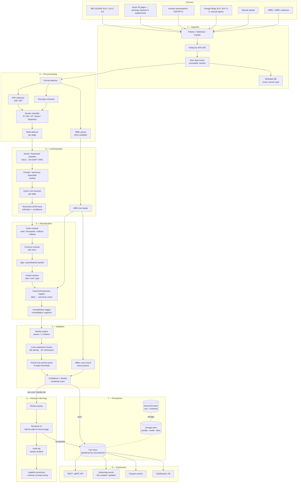

# Fundamentals Data Collection Pipeline — Design

LLM-based extraction of fundamentals from financial documents (10-K, 10-Q, 8-K / earnings releases, supplements, investor decks, XBRL, foreign filings) across **all sectors** (banks, insurance, industrials, tech, utilities, REITs, energy, healthcare).

This document covers:

1. Pipeline approaches considered (with pros / cons)
2. Recommended architecture (Mermaid)
3. Stage-by-stage design
4. **Mathematical Relationship Hierarchy** between line items
5. Validation rules, reconciliation, and review loop
6. Output / data contract

Companion files in this folder:
- [Functional Requirements.txt](Functional%20Requirements.txt)
- [Non Functional Requirements.txt](Non%20Functional%20Requirements.txt)

---

## 1. Pipeline Approaches Considered

We evaluated four extraction strategies before settling on the recommended hybrid. Each is summarized below with its trade-offs against the requirements (multi-format, multi-sector, accurate scale / currency / period detection, identity-safe).

### A. Pure LLM (vision) on PDF pages

The PDF is rasterized; each page image is sent to a multimodal LLM with a sector-aware prompt and the canonical taxonomy. The model returns structured JSON facts.

**Pros**
- Handles arbitrary layouts, including the messy footnote tables that defeat OCR.
- One pipeline covers every sector — taxonomy and prompt do the differentiation.
- Robust to scale / currency / footnote markers because the model sees the visual context, not just stripped text.
- Easiest to extend: a new sector = a new prompt block.

**Cons**
- Token cost per 10-K is non-trivial (~$1–3 per filing without optimization).
- Visual hallucination risk on dense numeric tables — must be paired with identity validation.
- Latency higher than text-only extraction; needs aggressive caching and parallelism.

### B. Pure LLM (text) on extracted PDF text

Use a PDF text extractor (pdfplumber / pdfminer / Mu-PDF) to pull the text, then send the text + canonical taxonomy to a text LLM.

**Pros**
- Cheapest token-wise (no images).
- Fastest per-page latency.

**Cons**
- Tables in PDFs lose their grid when flattened to text — column alignment breaks frequently, especially with merged cells, multi-line headers, and right-aligned numbers.
- Footnote markers, parentheses, and scale annotations end up adjacent to the wrong numbers.
- Scanned filings (older 10-Ks, foreign documents) have no text layer at all.
- Empirically, accuracy on bank filings drops below the NFR-1.1 99.5% target.

### C. Traditional OCR + table parser + rules

Camelot / Tabula / AWS Textract → DataFrame → rules engine maps headers to canonical names.

**Pros**
- Cheap and deterministic once it works on a layout.
- No LLM dependency in the hot path.

**Cons**
- Brittle: every layout change (and there are many across issuers) breaks rules.
- Cannot read footnotes or contextual scale notes intelligently.
- Multi-sector taxonomy mapping requires a maintenance-heavy rules library.
- Disqualified for the multi-sector / all-document-types scope.

### D. XBRL-first, LLM fallback

Pull pre-tagged XBRL from EDGAR / structured submissions when available; only invoke the LLM for non-XBRL docs (earnings releases, foreign filings, presentations).

**Pros**
- XBRL gives near-100% accuracy for free where it exists.
- Cuts LLM cost dramatically on US 10-K / 10-Q.

**Cons**
- XBRL coverage is uneven across foreign issuers and absent on earnings releases / 8-K supplements / presentations.
- XBRL tag misuse and extension elements still require mapping logic comparable to taxonomy mapping for plain text.
- Requires the LLM pipeline anyway — adds a parallel path to maintain.
- Useful as a *cross-check* rather than as the primary extractor.

### Recommendation

**Hybrid: Vision-LLM primary (Approach A), with XBRL used as a cross-validator (Approach D) when present.** This satisfies the user's chosen direction (LLM-based extraction across all document types) while using XBRL as a free accuracy lift on US filings, and ensures one consistent pipeline for every sector and every format.

| Property | A (Vision LLM) | B (Text LLM) | C (OCR + rules) | D (XBRL + LLM) | **Hybrid (A+D cross-check)** |
|---|---|---|---|---|---|
| All document types | ✅ | ⚠️ scanned fails | ⚠️ scanned fails | ❌ XBRL only | ✅ |
| All sectors | ✅ | ✅ | ❌ | ✅ | ✅ |
| Scale / currency detection | ✅ | ⚠️ | ⚠️ | ✅ | ✅ |
| Footnote / parenthetical handling | ✅ | ❌ | ❌ | ✅ | ✅ |
| Cost per 10-K | $$ | $ | $ | $ | $$ (lower w/ XBRL hits) |
| Maintenance burden | Low | Medium | High | Medium | Low–Medium |
| Accuracy on gold set | High | Medium | Low–Medium | High (where covered) | **Highest** |

---

## 2. Architecture (Mermaid)



---

## 3. Stage-by-stage Design

### Stage 1 — Ingestion

- **Sources**: EDGAR API, issuer IR pages, manual upload, internal webhook on filing events.
- **Storage**: write-once object store. Compute SHA-256 once at the boundary; deduplicate on hash. Persist `(document_id, hash, source_url, fetched_at)` in the metadata DB.
- **Output**: `(document_id, raw_bytes_uri, filing_metadata)`.

### Stage 2 — Pre-processing

- **Format detection** by MIME + magic bytes.
- **PDF**: rasterize to PNG at 200 DPI per page (vision LLM input); also extract the text layer for cross-checking and for fast section detection.
- **HTML / iXBRL**: parse DOM, isolate `<table>` blocks tagged with statement role.
- **XBRL**: parse instance + linkbase; emit `(concept, context, unit, value, decimals)` tuples.
- **Section classifier**: lightweight LLM (or fine-tuned encoder) tagging each page as `IS | BS | CF | Equity | Notes | Segments | MD&A | Other`. Pages tagged as primary statements go to Stage 3 first; notes and segments are processed second to reuse cached canonical context.
- **Table detector**: bbox per candidate table. Each table becomes one extraction unit.

### Stage 3 — LLM Extraction (vision, primary path)

For each candidate table:

1. **Context assembly** (cacheable via prompt caching):
   - System prompt: "You are a financial data extractor. Return only JSON conforming to schema X. Preserve sign and scale exactly."
   - Sector pack: bank / insurance / industrial / tech / utility / REIT / energy / healthcare. Includes sector-specific canonical names and identity hints (e.g. *Net Interest Income = Interest Income − Interest Expense*).
   - Canonical taxonomy and aliases.
   - Output schema (per FR-3.3).

2. **Per-table call**:
   - Inputs: page image(s) of the table, surrounding caption + footnote text, table_id, statement section.
   - Model returns: `{ rows: [ {reported_label, value, sign_as_printed, scale_hint, currency_hint, period_label, footnote_refs, bbox} ] }`.

3. **Confidence**: combine model self-rated confidence with structural checks (column count consistent, headers parsed, totals row present).

XBRL facts (when available) are loaded in parallel as an independent stream to be reconciled against the LLM output in Stage 5.

### Stage 4 — Normalization

Order matters — each step depends on the previous.

1. **Scale resolver**: read table-level scale annotation ("in millions", "$ thousands"); apply to every cell unless the row overrides (per-share lines stay in actuals). Raise scale conflict if the table-level says millions but the resulting numbers (e.g. EPS = 12,500,000) violate sanity ranges.
2. **Currency resolver**: ISO 4217 code from header / footnote / cover page. Convenience translations are stored alongside, never overwriting the primary.
3. **Sign / parenthetical handler**: `(1,234)` → `-1234`. Expense lines remain positive when reported positive; sign convention is captured, not coerced.
4. **Period resolver**: parse "Three Months Ended March 31, 2025" → `{period_type: quarterly, start: 2025-01-01, end: 2025-03-31}`. Stock vs flow distinction baked into canonical taxonomy.
5. **Taxonomy mapper**: `reported_label` → `canonical_name` via:
   - exact alias hit (fast path),
   - embedding similarity over the alias bank,
   - LLM tiebreaker only when similarity is ambiguous.
   Unmapped → review queue, never dropped.
6. **Consolidation tagger**: section context flags consolidated vs segment; segment dimension (business / geography / product) attached.

### Stage 5 — Validation

Two layers:

**A. Identity engine** (deterministic, declarative — see section 4 for the hierarchy). Every applicable parent = Σ children identity is checked, with rounding tolerance scaled to reporting unit.

**B. Cross-statement & cross-source checks**:
- Balance sheet identity: `Total Assets = Total Liabilities + Total Stockholders' Equity`.
- Cash flow roll-forward: `Cash[T] = Cash[T-1] + CFO + CFI + CFF + FX Effect`.
- IS → CF tie-out: `Net Income` on the income statement equals the starting line of indirect-method CFO.
- XBRL cross-check (where available): every concept that maps to a canonical name must agree to within tolerance; disagreements always go to review.
- Period-over-period sanity: |Δ| > 50% on stable line items (Total Assets, Revenue) flagged unless the prior column shows a corporate action (acquisition, divestiture, restatement disclosed in notes).

A fact is **persisted** only if it passes both layers OR if a reviewer has resolved it.

### Stage 6 — Human-in-the-loop

- **Triggers** (any one): `confidence < 0.85`, identity failure unresolved, taxonomy mapping ambiguous, period resolver rejected, scale conflict.
- **UI**: split view — fact JSON on the left, source page with bbox highlighted on the right, identity context (parent / siblings / computed delta) below.
- **Outcomes**: accept / edit / reject; every action logged with reviewer_id, reason code, before/after.
- **Feedback loop**: corrected facts feed (i) prompt evals, (ii) the alias bank, (iii) future fine-tuning datasets.

### Stage 7 — Persistence

- **Fact store**: columnar (Parquet on object store + a query layer such as Snowflake / BigQuery / DuckDB / Iceberg) for analytical scale, with a hot OLTP cache for recent periods.
- **Lineage store**: `(fact_id, document_id, page, bbox, model_version, prompt_version, taxonomy_version, raw_llm_response_uri)`.
- **Versioning**: every fact carries `model_version` and `taxonomy_version`. Re-extractions create new versions; nothing is overwritten.

### Stage 8 — Consumers

- **REST / gRPC**: point lookup, time-series, validation issues, review actions.
- **Events**: `fact.created`, `fact.updated`, `document.completed`, `validation.failed` for downstream pipelines (modeling, dashboards, alerting).
- **Bulk**: nightly Parquet snapshots for analytics.

---

## 4. Mathematical Relationship Hierarchy

The hierarchy is the **declarative source of truth** for parent ⇄ child sums across statements and sectors. It is loaded at runtime (YAML/JSON), versioned, and editable without redeploying services. Every identity has: `id`, `sector_scope`, `formula`, `tolerance`, `severity`.

> **Sign convention used below**: items are summed with the sign convention as reported by the issuer in the primary statement. Where an item is conventionally a contra (e.g. expenses, provisions) and an issuer reports it as a positive expense, the relationship is expressed with `−` so the math holds regardless. The engine evaluates both forms.

### 4.1 Income Statement — Generic (industrials, tech, retail, healthcare, energy, utilities, REITs)

```
Gross Profit                      = Revenue − Cost of Revenue

Operating Income                  = Gross Profit
                                  − Research & Development
                                  − Selling, General & Administrative
                                  − Other Operating Expenses

Income Before Income Tax Expense  = Operating Income
                                  + Interest Income
                                  − Interest Expense
                                  + Other Non-Operating Income / (Expense)

Net Income from Cont. Operations  = Income Before Income Tax Expense
                                  − Income Tax Expense

Net Income                        = Net Income from Cont. Ops.
                                  + Net Income from Discontinued Operations

Net Income Attr. to Common SH     = Net Income
                                  − Net Income Attr. to Non-Controlling Interests
                                  − Preferred Dividends

Diluted EPS                       = Net Income Attr. to Common SH
                                  ÷ Diluted Weighted-Avg Shares
```

### 4.2 Income Statement — Bank (matches the user's example; this is the canonical form)

```
Net Interest Income       = Interest Income − Interest Expense

Total Net Revenue         = Net Interest Income + Non-Interest Income

Income Before Tax Expense = Total Net Revenue
                          − Provision for Credit Losses
                          − Total Non-Interest Expense

Net Income                = Income Before Tax Expense − Income Tax Expense
```

> Equivalently, treating Provision and Non-Interest Expense with the issuer's reported sign and storing them in the row order they appear, the engine evaluates:
> `Income Before Tax Expense = Total Net Revenue + Provision for Credit Losses + Total Non-Interest Expense` when those rows are stored as negatives, which matches the example formulation in the task description.

### 4.3 Income Statement — Insurance

```
Total Revenue        = Premiums Earned
                     + Net Investment Income
                     + Net Realized Investment Gains / (Losses)
                     + Other Revenue

Total Benefits & Exp = Policyholder Benefits & Claims
                     + Interest Credited to Policyholders
                     + Amortization of DAC
                     + Operating Expenses

Income Before Tax    = Total Revenue − Total Benefits & Expenses
Net Income           = Income Before Tax − Income Tax Expense
```

### 4.4 Balance Sheet — Universal Identities

```
Total Current Assets     = Cash & Equivalents
                         + Short-Term Investments
                         + Accounts Receivable, net
                         + Inventories
                         + Prepaid Expenses & Other Current Assets

Total Non-Current Assets = PP&E, net
                         + Goodwill
                         + Intangible Assets, net
                         + Right-of-Use Assets
                         + Equity-Method Investments
                         + Deferred Tax Assets
                         + Other Non-Current Assets

Total Assets             = Total Current Assets + Total Non-Current Assets

Total Current Liabilities= Accounts Payable
                         + Accrued Liabilities
                         + Short-Term Debt + Current Portion LTD
                         + Operating Lease Liabilities, current
                         + Other Current Liabilities

Total Liabilities        = Total Current Liabilities
                         + Long-Term Debt
                         + Operating Lease Liabilities, non-current
                         + Deferred Tax Liabilities
                         + Other Non-Current Liabilities

Total Stockholders'      = Common Stock
  Equity                 + Additional Paid-In Capital
                         + Retained Earnings
                         + Accumulated OCI
                         − Treasury Stock
                         + Non-Controlling Interests

★ Total Assets           = Total Liabilities + Total Stockholders' Equity   (universal)
```

Sector overrides:
- **Banks**: Loans, net; Trading Assets; Deposits; Borrowings replace generic working-capital lines. The universal identity (★) still holds.
- **Insurance**: Investments at fair value; DAC; Insurance Reserves are major lines. (★) still holds.

### 4.5 Cash Flow Statement — Universal Identities

```
CFO  = Net Income
     + D&A
     + Stock-Based Compensation
     + Deferred Income Taxes
     + Provision for Credit Losses (banks)
     + Other Non-Cash Items
     + Σ Changes in Working Capital

CFI  = − CapEx
     − Acquisitions, net of cash
     − Purchases of Investments
     + Proceeds from Sales / Maturities of Investments
     + Other Investing Items

CFF  = + Proceeds from Debt Issuance
     − Repayments of Debt
     + Net Equity Issuance
     − Dividends Paid
     − Share Repurchases
     + Other Financing Items

Net Change in Cash = CFO + CFI + CFF + Effect of FX on Cash

★ Cash[T] = Cash[T-1] + Net Change in Cash    (roll-forward identity)
★ Net Income on CF = Net Income on IS         (cross-statement tie-out)
```

### 4.6 Per-Share Identities

```
Basic EPS    = (Net Income Attr. to Common SH) ÷ Basic Weighted-Avg Shares
Diluted EPS  = (Net Income Attr. to Common SH) ÷ Diluted Weighted-Avg Shares
Book Value per Share = Total Stockholders' Equity ÷ Shares Outstanding (period-end)
```

### 4.7 Hierarchy as a tree (top down)

```
Net Income
└── Income Before Income Tax Expense
│   ├── Operating Income                       [non-bank]
│   │   ├── Gross Profit
│   │   │   ├── Revenue
│   │   │   └── (−) Cost of Revenue
│   │   ├── (−) R&D
│   │   ├── (−) SG&A
│   │   └── (−) Other Operating Expenses
│   ├── Total Net Revenue                      [bank]
│   │   ├── Net Interest Income
│   │   │   ├── Interest Income
│   │   │   └── (−) Interest Expense
│   │   └── Non-Interest Income
│   ├── (−) Provision for Credit Losses        [bank]
│   ├── (−) Total Non-Interest Expense         [bank]
│   ├── (+) Interest Income / (−) Interest Expense  [non-bank]
│   └── (+) Other Non-Operating Income/(Expense)
└── (−) Income Tax Expense
```

### 4.8 Identity declaration format (illustrative YAML)

```yaml
- id: bank.income.netrevenue
  sector_scope: [banks]
  parent: TotalNetRevenue
  children:
    - {name: NetInterestIncome,  sign: +}
    - {name: NonInterestIncome,  sign: +}
  tolerance: { absolute: 1, unit: reporting_scale }   # e.g. ±$1M when reported in millions
  severity: error

- id: universal.bs.identity
  sector_scope: [all]
  formula: "TotalAssets == TotalLiabilities + TotalStockholdersEquity"
  tolerance: { relative: 0.0005 }                     # 5 bps
  severity: error

- id: universal.cf.rollforward
  sector_scope: [all]
  formula: "CashEnd == CashBeginning + CFO + CFI + CFF + FXEffect"
  tolerance: { absolute: 1, unit: reporting_scale }
  severity: error
```

---

## 5. Validation, Reconciliation, and Review

- **Tolerances** are scale-aware: ±1 unit in the reported scale is the default for sums; ±5 bps for the BS identity; ±10 bps for CF roll-forward.
- **Reconciliation order**: extracted-as-reported wins; derived values are stored in a separate column; XBRL facts are an independent source for cross-check, never an authority that overwrites the as-reported number unless explicitly configured.
- **Failure routing**:
  - `severity: error` + tolerance breach → review queue, fact NOT visible to consumers.
  - `severity: warn` → fact visible with a `validation_warnings[]` annotation.
- **Reviewer SLA**: 24h for blocking issues during earnings season, 72h otherwise.

---

## 6. Output / Data Contract

Each persisted fact (illustrative JSON):

```json
{
  "fact_id": "fct_8b7…",
  "issuer": { "cik": "0000019617", "ticker": "JPM", "lei": "..." },
  "canonical_name": "TotalNetRevenue",
  "reported_label": "Total net revenue",
  "value_as_reported": 41937,
  "scale": "millions",
  "currency": "USD",
  "normalized_value": 41937000000,
  "sign_as_reported": "+",
  "period": {
    "type": "quarterly",
    "start_date": "2025-01-01",
    "end_date": "2025-03-31",
    "fiscal_year": 2025,
    "fiscal_quarter": 1
  },
  "consolidation": { "level": "consolidated", "segment_id": null },
  "framework": "US-GAAP",
  "restatement_flag": "as-reported",
  "audit_status": "unaudited",
  "source": {
    "document_id": "doc_…",
    "section": "Consolidated Statements of Income",
    "page": 5,
    "bbox": [72, 410, 540, 462],
    "table_id": "tbl_3"
  },
  "extraction": {
    "method": "vision-llm",
    "model_version": "claude-opus-4-7@2026-04",
    "prompt_version": "v17",
    "taxonomy_version": "v9",
    "confidence": 0.97,
    "extracted_at": "2026-04-15T14:22:11Z"
  },
  "validation": {
    "identities_passed": ["bank.income.netrevenue"],
    "identities_failed": [],
    "warnings": []
  }
}
```

---

## 7. Open Decisions

These remain to be locked down before a build kicks off:

1. **LLM provider mix** — Claude as primary across all sectors, with a fallback (e.g. GPT-class) for failover only? Or sector-specific routing?
2. **Fact store engine** — Iceberg + DuckDB / Trino vs Snowflake vs BigQuery. Drives cost and ops profile.
3. **Review UI build vs buy** — internal Next.js app vs Label Studio / Argilla extension.
4. **Fine-tuning vs prompt-only** — start prompt-only on Opus / Sonnet; revisit fine-tuning after 6–12 months of labeled corrections accrue.
5. **Foreign-issuer currency translation policy** — store as reported only, or also store USD-translated convenience values via a chosen FX source (period-average vs period-end)?
